# 📘 Полное руководство по коду MediaVault

> **Для кого:** Для тех, кто впервые видит этот код и хочет понять, как всё устроено.
> **Формат:** Объяснения простым языком + Mermaid-диаграммы.
> **Проект:** Медиа-теггер + загрузчик тегов с booru-сайтов (Rule34, Danbooru) + ридер комиксов.

---

## 📋 Содержание

1. [Что это вообще такое?](#1-что-это-вообще-такое)
2. [Словарь терминов](#2-словарь-терминов)
3. [Структура проекта](#3-структура-проекта)
4. [Как всё запускается](#4-как-всё-запускается)
    - [4.2 Сборка бинарника (PyInstaller)](#42-сборка-бинарника-pyinstaller)
5. [База данных (SQLite)](#5-база-данных-sqlite)
6. [Сервер: web_app.py](#6-сервер-web_apppy)
7. [Фронтенд: шаблоны, JS-модули, CSS и i18n](#7-фронтенд-шаблоны-js-модули-css-и-i18n)
8. [Таб «Tagfetch» (загрузка тегов)](#8-таб-tagfetch-загрузка-тегов)
9. [Таб «MediaVault» (галерея + lightbox)](#9-таб-mediavault-галерея--lightbox)
10. [Comics — создание и просмотр комиксов](#10-comics--создание-и-просмотр-комиксов)
11. [Hover preview (cpagePreview)](#11-hover-preview-cpagepreview)
12. [Sort System — сортировка по дате](#12-sort-system--сортировка-по-дате)
13. [Мобильный хедер и drawer](#13-мобильный-хедер-и-drawer)
14. [Как добавлять новую фичу](#14-как-добавлять-новую-фичу)
15. [Известные грабли](#15-известные-грабли)
16. [Система авторизации](#16-система-авторизации)
17. [Система логирования](#17-система-логирования)
18. [SVG иконки темы и spin-анимация](#18-svg-иконки-темы-и-spin-анимация)
19. [Унификация JS-утилит в Shared](#19-унификация-js-утилит-в-shared)
20. [Декораторы: правильный порядок и @api_error_handler](#20-декораторы-правильный-порядок-и-api_error_handler)
21. [Credential Store: хранение API-ключей](#21-credential-store-хранение-api-ключей)
22. [Thumbnail System: регенерация с SSE](#22-thumbnail-system-регенерация-с-sse)
 23. [Content Management: новая структура роутов](#23-content-management-новая-структура-роутов)
 24. [Новые фичи (new-features branch)](#24-новые-фичи-new-features-branch)

---

## 1. Что это вообще такое?

**MediaVault** — это Flask-приложение (один файл `src/web_app.py`, 7671 строка, 121+ роутов, 72 `@admin_required`, 13 `@auth_required`, 100 `@api_error_handler`) с 17 Jinja2-шаблонами, 33 JS-файлами, 8 CSS-файлами и модулями бэкендов/плагинов:

> **Планируется переезд на TypeScript (Hono + Svelte 5 + Bun)** — см. [`docs/TECH-STACK-REVIEW.md`](TECH-STACK-REVIEW.md) для полного плана миграции.

1. **Скачивает теги** с Rule34.xxx, Danbooru и NHentai по MD5-хешу файла
2. **Позволяет тегировать** свою медиа-коллекцию (картинки, видео)
3. **Показывает галерею** с поиском, фильтрацией, лайтбоксом
4. **Автоматически определяет** тип файла (photo/video), соотношение сторон (16:9, 4:3)
5. **Позволяет создавать комиксы/мангу** из произвольных файлов с drag-and-drop сортировкой
6. **Встроенный ридер** с scroll и lightbox режимами, навигацией клавишами
7. **Авторизация** per-user: username+password, сессии, админ-панель

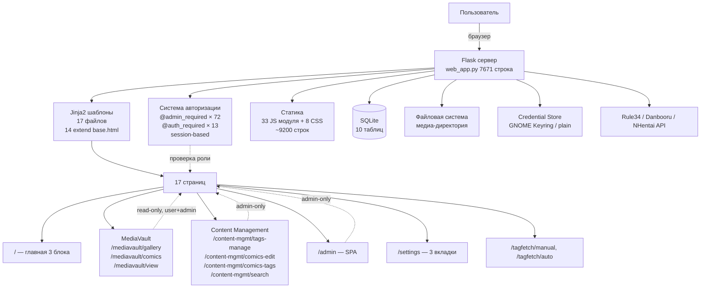

---

## 2. Словарь терминов

| Термин | Что значит |
|--------|-----------|
| **API** | Способ общения браузера с сервером. Браузер посылает HTTP-запрос, сервер отвечает JSON. Пример: «покажи список файлов», «сохрани теги» |
| **AVIF** | Современный формат сжатия картинок (в 2-3x сильнее JPEG). MediaVault использует AVIF для миниатюр — занимают меньше места в БД |
| **Auto-tags** | Теги, которые сервер присваивает автоматически по расширению файла: `photo` (jpg/png), `video,animated` (mp4/webm), `gif`, `sound`. Плюс соотношение сторон (`16:9`, `4:3`). Функция `_get_auto_tags()` |
| **BLOB** (Binary Large Object) | Бинарные данные в SQLite. В MediaVault — AVIF-байты превьюшки в `thumbnail_cache.data`. Ключ кэша: MD5(relpath)+mtime |
| **Booru** | Сайты с изображениями и тегами: Rule34.xxx (XML API) и Danbooru (JSON API). Сервер ходит к ним по MD5 файла и забирает теги. См. Danbooru, Rule34 |
| **check_status** | Эндпоинт `/api/check_status` — возвращает статусы для списка путей (db/found/not_found/no_tags). Используется в `manual-v2.js` для расстановки `data-status` на `.path-item`. Приоритет: db > found > not_found > no_tags |
| **Cover** | Обложка комикса — один из файлов-страниц, помеченный `cover_path` в таблице `comics`. Выбирается через кнопку ★ в cpageGrid |
| **cpage\*** | Префикс элементов файлового браузера для выбора страниц комикса: `cpageGrid`, `cpageSearch`, `cpageSortDateBtn`, `cpagePreview`, `cpage-item`, `cpage-star`. Ранее назывался `cp*` (Comic Picker) |
| **CSS** (Cascading Style Sheets) | Язык для внешнего вида страниц: цвета, шрифты, отступы, анимации. В проекте 8 CSS-файлов (2960 строк). Все CSS-переменные определены в `shared.css` |
| **Danbooru** | Сайт с аниме-артом, где картинки размечены тегами по категориям (artist/character/copyright/general/meta). MediaVault ищет теги на Danbooru по MD5 файла через JSON API |
| **Effects toggle** | CSS-эффекты (анимации, тени, переходы) можно отключить через `/api/effects` — атрибут `data-no-effects` на `<html>`. Полезно для слабых машин |
| **Flask** | Веб-фреймворк на Python. Движок MediaVault — принимает запросы, работает с БД, отдаёт HTML/JSON |
| **FFmpeg** | Программа для работы с видео/аудио. Нужна для: превью-кадра из видео, определения звука (`sound`), AVIF-кодирования видео |
| **i18n** (internationalization) | Система перевода интерфейса. В MediaVault — английский и русский. Сервер: `LOCALE` dict → `_()` в Jinja2. Клиент: `_i18nData` → `Shared.t('key')`. Переключается через `Shared.toggleLang()` без перезагрузки |
| **IIFE** (Immediately Invoked Function Expression) | Паттерн JS-модулей: `(function() { ... })()`. Все модули в проекте так написаны — приватные переменные внутри, публичный API через `return { ... }` |
| **In-memory cache** | Python-словари `_api_cache` и `_md5_cache` в `web_app.py`. Хранят результаты запросов к API booru-сайтов. **Теряются при рестарте сервера** |
| **Jinja2** | Язык шаблонов Python. MediaVault использует его, чтобы вставлять данные в HTML на сервере. Пример: `{{ _('save') }}` вставит «Сохранить» или «Save» |
| **JSON** (JavaScript Object Notation) | Формат передачи данных: `{"username": "admin", "role": "admin"}`. Все 55 API MediaVault отвечают в JSON |
| **KeyringStore** | Хранилище API-ключей в GNOME Keyring через библиотеку `keyring`. Падает на plain text в settings.json если keyring недоступен |
| **Lightbox** | Режим просмотра на весь экран с затемнённым фоном, зумом, навигацией ← → и панелью тегов. Два режима: отдельные файлы и комиксы |
| **Masonry** | Раскладка галереи «как Pinterest» — колонки фиксированной ширины, элементы разной высоты. Через CSS `column-width`, без JS-библиотек |
| **MD5** (хеш) | Короткая «подпись» файла (32 символа). Если у двух файлов одинаковый MD5 — это 100% один и тот же файл. Booru-сайты хранят MD5, по нему MediaVault ищет теги. Считается на клиенте через `crypto.subtle.digest()` |
| **mtime** | modification time — время последнего изменения файла (Unix timestamp). В `files.mtime`. Используется для сортировки по дате |
| **Non-meta tags** | Все теги, кроме auto-tags и соотношений сторон. `_has_non_meta_tags()` проверяет есть ли «настоящие» теги (не служебные). Если нет — файл считается нетегированным |
| **Path traversal** | Атака через `../../etc/passwd`. Защита — `_safe_media_path()` нормализует путь и проверяет что он внутри `media_dir` |
| **Pillow** (PIL) | Библиотека Python для работы с картинками. Используется для: определения размеров, создания превью, определения типа файла, AVIF-кодирования |
| **Range support** | HTTP-заголовок `Range`, позволяющий стримить видео по частям. Без него не работает скроллинг и пауза в видео. Реализован в `/api/media` |
| **Rule34** | Booru-сайт, специализирующийся на взрослом контенте. MediaVault ищет теги через XML API по MD5 файла. Требует UID + API Key для доступа |
| **source** (в tag_category_members) | Колонка, указывающая откуда пришла категоризация тега: `'danbooru'` — из Danbooru API, `'rule34'` — эвристика Rule34, `'auto'` — предустановленные мета-теги, `'manual'` — ручное назначение |
| **SPA** (Single Page Application) | Страница без перезагрузки. Content Management, Admin Panel, Settings — SPA с переключением секций через JS. Остальные — отдельные шаблоны с полной перезагрузкой |
| **SQLite** | Встраиваемая база данных в одном файле. Файл: `~/.local/share/MediaVault/MediaVaultDataBase.db`, 10 таблиц. Не требует установки сервера |
| **SSE** (Server-Sent Events) | Протокол для стриминга событий с сервера на клиент в реальном времени. Используется в `/api/auto_scan` и `/api/regenerate_thumbnails/stream` |
| **Visual order** | Порядок элементов в DOM для masonry отличается от визуального. `getVisualOrder()` сортирует по `getBoundingClientRect()` (top → left) для счётчика `lb-pos` |
| **Авто-сканирование** (Auto Scan) | Ранее **Batch Scan** — автоматическое сканирование медиа-папки. SSE-поток с прогрессом по каждому файлу. Только auto-tags, без API. Запускается при старте сервера в фоне |
| **Админ-панель** (Admin Panel) | Страница `/admin`: управление пользователями, API-ключами, базой данных |
| **Декоратор** (decorator) | Пометка над функцией Python, добавляющая поведение. В проекте: `@admin_required` (72 шт), `@auth_required` (13 шт), `@api_error_handler` (100 шт). Порядок: `@app.route` → auth → handler |
| **Категории тегов** | Группы тегов с цветами: Artist (голубой), Character (оранжевый), Copyright (фиолетовый), General (зелёный), Meta (синий). Таблицы: `tag_categories` + `tag_category_members` |
| **Комикс** (comic) | Подборка файлов для последовательного чтения. Два режима: Scroll (лента) и Lightbox (постранично). Таблицы: `comics` + `comic_pages` (FK с CASCADE) |
| **Медиа-директория** (media_dir) | Путь к папке с медиафайлами. Указывается в Settings → Appearance. Сканируется при старте через `_quick_scan()` |
| **Миниатюра** (thumbnail, превью) | Уменьшенная копия картинки/видео для галереи. Формат AVIF, хранится как BLOB в `thumbnail_cache`. Ключ: MD5(path)+mtime. Создаётся через Pillow/FFmpeg |
| **Пользователь** (user) | Роль `user` — только просмотр галереи и комиксов. Не может редактировать теги, менять настройки. Роль задаётся в `/api/admin/users/` |
| **Ручное сканирование** (Manual Scan) | Ранее **Single Scan** — поиск тегов для одного файла. Браузер файлов → расчёт MD5 → запрос к API → показ результата. Режим Tagfetch → Manual |
| **Сканирование** (scan) | Обход медиа-папки, поиск новых файлов, добавление в БД с авто-тегами |
| **Тег** (tag) | Ключевое слово, описывающее содержимое файла: `cat`, `sunset`, `1girl`. Хранятся в таблице `tags`, связь с файлами — через `files.tags` (строка через запятую) |
| **Хранилище ключей** (credential store) | Хранение API-ключей Rule34/Danbooru. `src/credential_store.py`: `KeyringStore` (GNOME Keyring) или `None` (plain text в `settings.json`). Переключение через `/api/set_credential_backend` |


---

## 3. Структура проекта

```
MediaVault/
├── src/
│   ├── web_app.py             ← ВЕСЬ СЕРВЕР (7671 строка, 121+ роутов)
│   ├── credential_store.py    ← Хранилище API-ключей (GNOME Keyring / plain text)
│   ├── plugins/               ← Система плагинов (2 модуля + hentaichan)
│   │   ├── __init__.py        ← PluginManager: register, load_all, get_plugin
│   │   └── interface.py       ← PluginInterface: search(), get_gallery(), metadata
│   └── backends/              ← Система бэкендов для тегов (2 модуля)
│       ├── __init__.py        ← BACKENDS registry, fetch_tags(), search_tags()
│       ├── api_raw.py         ← ApiRawBackend (Rule34 + Danbooru + NHentai)
│       └── gallerydl.py       ← GalleryDlBackend (Rule34 + Danbooru + NHentai + E-Hentai + Kemono + Coomer)
├── templates/                 ← Jinja2-шаблоны (17 файлов, 14 extend base.html)
│   ├── base.html              ← Главный скелет: <head>, CONFIG, JS, CSS, footer
│   ├── home.html              ← Главная страница / (3 блока, Three.js bg)
│   ├── login.html             ← Страница логина (standalone, не extend base.html)
│   ├── settings.html          ← Настройки: Appearance, Database, Account (SPA, tab-кнопки)
│   ├── content-search.html    ← Content Search: unified поиск по сайтам
│   ├── nhentai_search.html    ← Страница поиска NHentai
│   ├── kemono_import.html     ← Страница импорта с Kemono/Coomer
│   ├── similar.html           ← Страница похожих файлов
│   ├── shared/
│   │   ├── macros.html        ← Jinja2-макросы (password_field, theme_buttons и др.)
│   │   ├── gallery.html       ← Галерея + comics tabs + lightbox
│   │   ├── view.html          ← Просмотр standalone + comics reader
│   │   ├── popular_tags.html  ← Популярные теги
│   │   └── comics-list.html   ← Список комиксов (MV + CM режимы)
│   ├── tagfetch/
│   │   ├── manual.html        ← Ручной режим
│   │   └── auto.html          ← Авто-режим (SSE)
│   ├── content-mgmt/
│   │   └── tags.html          ← Управление тегами/категориями
│   └── admin/
│       └── admin.html         ← SPA Admin Panel: 6 разделов
├── static/
│   ├── css/                   ← 8 файлов, 2960 строк
│   │   ├── shared.css         ← CSS vars, темы, base, header, mobile
│   │   ├── content.css        ← Content SPA: drag-drop теги, файлы, комиксы
│   │   ├── content-search.css ← Content Search: search bar, grid, mobile
│   │   ├── admin.css          ← Admin SPA: карточки, таблицы, модалы, mount indicator
│   │   ├── mediavault.css     ← Галерея, лайтбокс, комиксы, тегирование
│   │   ├── tagfetch.css       ← Tagfetch стили
│   │   ├── settings.css       ← Settings SPA: табы, карточки, DB tools grid
│   │   └── shared-grid.css    ← Shared grid renderer: comics, tags-manage
│   ├── shared/                ← Общий JS (shared модули)
│   │   ├── utils.js           ← i18n словари, layout utilities (1071 строка)
│   │   ├── lightbox.js        ← Единый лайтбокс (zoom, nav, tags, swipe, 1127 строк)
│   │   ├── find-originals.js  ← Find Originals модал (IIFE, 428 строк)
│   │   ├── mobile-search.js   ← MobileSearch (IIFE, 84 строки)
│   │   ├── grid-renderer.js   ← ES-модуль: render сеток для comics-tags, tags-manage (149 строк)
│   │   ├── api.js             ← Базовый fetch (37 строк)
│   │   ├── init.js            ← Точка входа: drawer, banner, init страниц (101 строка)
│   │   ├── home-bg.js         ← Three.js фон (ES модуль, 145 строк)
│   │   ├── icons.js           ← window.SiteIcons SVG-иконки (26 строк)
│   │   ├── gallery/
│   │   │   ├── gallery.js     ← Галерея + сортировка, popular tags (856 строк)
│   │   │   ├── lightbox.js    ← Лайтбокс-враппер (96 строк)
│   │   │   └── tags.js        ← UI тегирования + категории, cat cache (224 строки)
│   │   ├── grid/
│   │   │   └── shared-grid.js ← Shared grid: кастомные сетки комиксов (140 строк)
│   │   └── comics/
│   │       ├── comics.js      ← ComicsPicker: cpGrid, preview, DnD (621 строка)
│   │       ├── comics-list.js ← Список комиксов (117 строк)
│   │       ├── comics-search.js← Поиск по комиксам (65 строк)
│   │       └── picker-bridge.js← ES-мост ComicsPicker (53 строки)
│   ├── tagfetch/              ← Tagfetch модуль
│   │   ├── tagfetch.js        ← Определение вкладки из URL (17 строк)
│   │   ├── api.js             ← API-вызовы (96 строк)
│   │   ├── manual/manual-v2.js← Ручной режим + файловый браузер (648 строк)
│   │   └── auto/auto.js       ← Автоматический режим (SSE, 395 строк)
│   ├── mediavault/            ← MediaVault модуль
│   │   ├── mediavault.js      ← Оркестратор: связь всего, mobile search sync (287 строк)
│   │   ├── db.js              ← Работа с БД (26 строк)
│   │   └── api.js             ← API-вызовы (47 строк)
│   ├── content/               ← Content Manager ES модули
│   │   ├── main.js            ← Точка входа (108 строк)
│   │   ├── content-search.js  ← Unified поиск (ES модуль, 957 строк)
│   │   ├── comics-tags.js     ← Comics drag-to-tag (ES модуль, 224 строки)
│   │   ├── nhentai_search.js  ← NHentai поиск (ES модуль, 180 строк)
│   │   ├── tags.js            ← CRUD категорий (236 строк)
│   │   ├── tags-manage/
│   │   │   └── tags-manage.js ← Файлы, masonry, lightbox (505 строк)
│   │   ├── comics.js          ← CRUD комиксов (117 строк)
│   │   └── utils.js           ← Утилиты, делегаты к Shared (51 строка)
│   └── admin/
│       └── admin.js           ← AdminDashboard SPA (1306 строк, 6 разделов + mount monitoring)
├── static/shared/icons/       ← SVG файлы: rule34.svg, danbooru.svg, nhentai.svg, ehentai.svg, kemono.svg, coomer.svg
├── AGENTS.md                  ← Памятка для OpenCode
├── docs/code-guide.md         ← ЭТОТ ФАЙЛ
└── roadmap/
    └── roadmap.md             ← Прогресс фич
```

### Сколько кода?

| Файл | Строк | Что делает |
|------|-------|------------|
| **Python** | | |
| `web_app.py` | 7671 | **Весь сервер** — 121+ роутов, БД, кэш, i18n, auth, backends, plugins |
| `credential_store.py` | 124 | Хранилище API-ключей (Keyring / plain text) |
| `backends/__init__.py` | 44 | BACKENDS registry, fetch_tags(), search_tags() |
| `backends/api_raw.py` | 372 | ApiRawBackend: Rule34 + Danbooru + NHentai fetch + search |
| `backends/gallerydl.py` | 455 | GalleryDlBackend: Rule34 + Danbooru + NHentai + E-Hentai + Kemono + Coomer |
| `plugins/__init__.py` | 193 | PluginManager: register, load_all, get_plugin |
| `plugins/interface.py` | 86 | PluginInterface: search(), get_gallery(), metadata |
| **Total Python** | **8945** | **8 файлов** |
| **JS** | | |
| `admin/admin.js` | 1306 | AdminDashboard SPA: 6 разделов + mount monitoring |
| `shared/lightbox.js` | 1127 | Единый лайтбокс (zoom, nav, tags, swipe) |
| `shared/utils.js` | 1071 | i18n словари, layout utilities |
| `content/content-search.js` | 957 | Unified поиск по сайтам (ES модуль) |
| `shared/gallery/gallery.js` | 857 | Галерея: загрузка, фильтр, пагинация, сортировка, popular tags |
| `tagfetch/manual/manual-v2.js` | 648 | Ручной режим Tagfetch + файловый браузер |
| `shared/comics/comics.js` | 554 | Файловый браузер ComicsPicker (cpGrid, preview, DnD) |
| `content/tags-manage/tags-manage.js` | 500 | Файлы, masonry, lightbox |
| `shared/find-originals.js` | 428 | Find Originals модал (IIFE) |
| `tagfetch/auto/auto.js` | 395 | Авто-режим Tagfetch (SSE) |
| `mediavault/mediavault.js` | 287 | Оркестратор: связывает всё, mobile search sync |
| `content/tags.js` | 236 | CRUD категорий |
| `shared/gallery/tags.js` | 224 | UI тегирования + категории, cat cache |
| `content/comics-tags.js` | 240 | Comics drag-to-tag (ES модуль) |
| `content/nhentai_search.js` | 180 | NHentai поиск (ES модуль) |
| `shared/grid-renderer.js` | 149 | ES-модуль: render сеток для comics-tags, tags-manage |
| `shared/home-bg.js` | 145 | Three.js фон (ES модуль) |
| `shared/grid/shared-grid.js` | 140 | Shared grid: кастомные сетки комиксов |
| `shared/comics/comics-list.js` | 117 | Список комиксов (MV view, add-card для admin) |
| `content/comics.js` | 215 | CRUD комиксов |
| `content/main.js` | 107 | Точка входа Content Manager (ES модуль) |
| `shared/init.js` | 101 | Точка входа, drawer, banner, инициализация страниц |
| `shared/gallery/lightbox.js` | 96 | Лайтбокс-враппер (делегирует в Shared) |
| `tagfetch/api.js` | 96 | API-вызовы (autoStatus, autoScan) |
| `shared/mobile-search.js` | 84 | MobileSearch (IIFE) |
| `shared/comics/comics-search.js` | 65 | Поиск по комиксам |
| `shared/comics/picker-bridge.js` | 53 | ES-мост ComicsPicker |
| `content/utils.js` | 51 | Утилиты, делегаты к Shared (ES модуль) |
| `mediavault/api.js` | 47 | API-вызовы |
| `shared/api.js` | 37 | Базовый fetch с обработкой ошибок |
| `shared/icons.js` | 26 | Site icons: SVG-иконки для всех сайтов |
| `mediavault/db.js` | 26 | Работа с БД |
| `tagfetch/tagfetch.js` | 17 | Определение вкладки из URL (getCurrentTab) |
| **Total JS** | **~10580** | **33 файла** (без lib/three.module.js) |
| **CSS** | | |
| `content.css` | 788 | Content SPA: drag-drop теги, файлы, комиксы |
| `admin.css` | 646 | Admin SPA: карточки, таблицы, модалы, mount indicator |
| `content-search.css` | 352 | Content Search: search bar, grid, mobile |
| `shared.css` | 339 | CSS vars, темы, base, header, mobile |
| `mediavault.css` | 335 | Галерея, лайтбокс, комиксы, тегирование, хедер |
| `tagfetch.css` | 248 | Tagfetch |
| `settings.css` | 179 | Settings SPA: табы, карточки, DB tools grid |
| `shared-grid.css` | 73 | Shared grid: кастомные сетки комиксов |
| **Total CSS** | **2960** | **8 файлов** |
| **Templates** | | |
| `settings.html` | 596 | Настройки: Appearance, Database, Account (SPA) |
| `shared/view.html` | 421 | Просмотр standalone + comics reader |
| `home.html` | 386 | Главная 3 блока + Three.js bg |
| `base.html` | 343 | Главный скелет: head, CONFIG, JS, CSS, footer |
| `login.html` | 177 | Логин username+password (standalone) |
| `shared/gallery.html` | 152 | Галерея + comics tabs + lightbox |
| `content-search.html` | 138 | Content Search: unified поиск по сайтам |
| `kemono_import.html` | 138 | Страница импорта с Kemono |
| `shared/comics-list.html` | 117 | Список комиксов (MV + CM режимы) |
| `tagfetch/auto.html` | 122 | Авто-режим Tagfetch (SSE) |
| `nhentai_search.html` | 110 | Страница поиска NHentai |
| `tagfetch/manual.html` | 102 | Ручной режим Tagfetch |
| `admin/admin.html` | 61 | Admin SPA (6 разделов) |
| `similar.html` | 47 | Страница похожих файлов |
| `shared/macros.html` | 41 | 6 Jinja2-макросов |
| `shared/popular_tags.html` | 31 | Популярные теги |
| `content-mgmt/tags.html` | 28 | Управление тегами/категориями |
| **Total templates** | **~3010** | **17 файлов** |
| **Total** | **~26495** | **Весь проект** (Python 8945 + JS ~10580 + CSS 2960 + Templates ~3010) |

---

## 4. Как всё запускается

### Команды запуска

```bash
venv/bin/python src/web_app.py             # http://0.0.0.0:5050
venv/bin/python src/web_app.py --debug     # auto-reload + verbose logging
venv/bin/python src/web_app.py --bind 127.0.0.1
venv/bin/python test.py                    # syntax + locale + dead code + func tests
venv/bin/python test.py --check smoke      # smoke test (Flask start + page load)
```

### Что происходит при запуске: пошагово

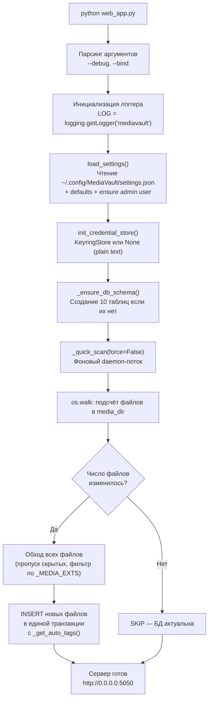

**Ключевые моменты:**
- `_quick_scan` работает в **фоновом daemon-потоке** — сервер стартует сразу, не ждёт сканирования
- Только **INSERT новых** файлов — существующие не обновляются
- Скрытые директории (`.thumb_cache`, `.Trash-1000`, `@eaDir`) и скрытые файлы пропускаются
- Для каждого нового файла вызывается `_get_auto_tags(filepath)` — присваиваются авто-теги
- Все INSERT'ы в **одной транзакции** — быстро и атомарно
- Если `media_dir` не настроен — сканирование пропускается

### Файл: `test.py` (975 строк)

Скрипт `venv/bin/python test.py` выполняет:
1. **Синтаксические проверки** (`--check py` / `--check js` / `--check css`): компиляция Python, AST-парсинг i18n, проверка JS через node
2. **Locale check** (`--check locale`): проверка parity en↔ru, JS sync, дубликаты
3. **Dead code check** (`--check dead`): AST (Python) + regex (JS) — неиспользуемые функции
4. **Function tests** (`--check func`): инжект тестовых функций Python (`_has_non_meta_tags()`, `_get_aspect_ratio_tag()` и др.)
5. **Smoke test** (`--check smoke`): запуск Flask на :15050, GET /login (200) + /api/gallery (401)

### 4.2 Сборка бинарника (PyInstaller)

```bash
# Установить PyInstaller (один раз)
venv/bin/pip install pyinstaller

# Собрать
venv/bin/pyinstaller mediavault.spec --clean --noconfirm

# Запуск
./dist/mediavault/mediavault

# С флагами
./dist/mediavault/mediavault --debug
./dist/mediavault/mediavault --bind 127.0.0.1
```

**Что внутри бинарника:** Python + Flask + Pillow + requests + keyring, все шаблоны (17 .html), вся статика (CSS/JS/Three.js/шрифты).

**Что НЕ встроено:** FFmpeg/FFprobe — используются из системы (через `$PATH`). Установи: `sudo apt install ffmpeg`. База и настройки — те же `~/.local/share/MediaVault/` и `~/.config/MediaVault/`.

**Механизм:** при запуске бинарника `sys.frozen == True`, `_basedir` переключается на `sys._MEIPASS` — временную папку, куда PyInstaller распаковывает файлы. Flask находит шаблоны/статику через `_basedir` как обычно.

**Сборка `--onefile` vs `--onedir`:** в `mediavault.spec` используется `--onefile` (все зависимости упакованы в один ELF). Отличия:
- `--onefile` (текущий): один файл `dist/mediavault` (~29 MB), на старте распаковывается в `/tmp`, первый запуск ~3-4 сек.
- `--onedir` (альтернатива): папка `dist/mediavault/` с `_internal/` + загрузчиком (7 MB), запуск без задержки. Для переключения нужен COLLECT в spec.

### 4.3 AUR пакет

Скрипты сборки для Arch Linux лежат в `packaging/aur/mediavault-bin/`:

| Файл | Назначение |
|------|-----------|
| `PKGBUILD` | Описание пакета (`pkgver`, `depends`, `source`, `sha256sums`) |
| `mediavault.install` | Хуки: `post_install` (подсказка про gnome-keyring), `post_remove` (напоминание о данных) |

**Релизный процесс:**

```bash
# 1. Собрать бинарник
venv/bin/pyinstaller mediavault.spec --clean --noconfirm

# 2. Переименовать (добавить платформу)
mv dist/mediavault dist/mediavault-linux-amd64

# 3. Посчитать хеш
sha256sum dist/mediavault-linux-amd64

# 4. Создать GitHub Release v1.0.0, загрузить туда binary
# 5. Обновить packaging/aur/mediavault-bin/PKGBUILD: pkgver, sha256sums
# 6. Скопировать packaging/aur/mediavault-bin/ в AUR git-репозиторий и запушить
```

`depends=('ffmpeg')` — ffprobe нужен для видео-превью и определения звука.
`optdepends=('gnome-keyring')` — keyring использует SecretService на Linux.

---

## 5. База данных (SQLite)

### Расположение

```
~/.local/share/MediaVault/MediaVaultDataBase.db
```

Создаётся автоматически при первом запуске функцией `_ensure_db_schema()` (строка 1084).

### ER-диаграмма

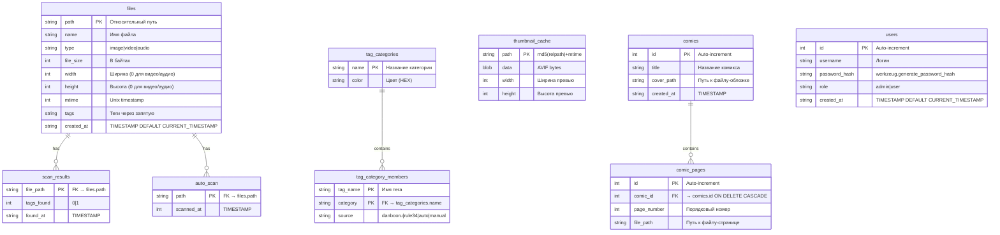

### 10 таблиц (детально)

| # | Таблица | Назначение | Ключевые поля |
|---|---------|-----------|---------------|
| 1 | `files` | Главная таблица: один файл = одна строка | `path` (TEXT PK), `name`, `type`, `file_size`, `mtime`, `tags`, `width`, `height` |
| 2 | `tag_categories` | Категории тегов с цветами | `name` (TEXT PK), `color` (TEXT) |
| 3 | `tag_category_members` | Связь тега с категорией | `tag_name` (TEXT PK), `category` (TEXT PK), `source` (TEXT) |
| 4 | `scan_results` | Результат поиска тегов через API | `file_path` (TEXT PK), `tags_found` (INT), `found_at` (TEXT) |
| 5 | `auto_scan` | Отметка что файл проскандирован | `path` (TEXT PK), `scanned_at` (INTEGER) |
| 6 | `thumbnail_cache` | Кэш AVIF-превью | `path` (TEXT PK), `data` (BLOB), `width` (INT), `height` (INT) |
| 7 | `comics` | Комиксы | `id` (INTEGER PK AUTOINCREMENT), `title`, `cover_path` |
| 8 | `comic_pages` | Страницы комиксов | `id` (INTEGER PK AUTOINCREMENT), `comic_id` (→ comics.id ON DELETE CASCADE), `page_number`, `file_path` |
| 9 | `users` | Пользователи | `id` (INTEGER PK AUTOINCREMENT), `username`, `password_hash`, `role`, `created_at` |
| 10 | `sqlite_sequence` | Служебная SQLite для autoincrement | — |

### Расширения медиафайлов

Константы в `web_app.py` (определены сразу после импортов):

| Константа | Кол-во | Расширения |
|-----------|--------|------------|
| `_IMAGE_EXTS` | **6** | `jpg`, `jpeg`, `png`, `webp`, `bmp`, `gif` |
| `_VIDEO_EXTS` | **5** | `mp4`, `webm`, `mov`, `avi`, `mkv` |
| `_AUDIO_EXTS` | **6** | `mp3`, `wav`, `flac`, `ogg`, `m4a`, `aac` |
| `_MEDIA_EXTS` | **17** | Объединение всех трёх (union) |

Тип файла определяет функция `_get_file_type(ext)` (строка 1205).

### Thumbnail константы

| Константа | Значение | Назначение |
|-----------|----------|------------|
| `_THUMB_LARGE` | **360** | Ширина обычных превью |
| `_THUMB_XL` | **600** | Ширина для панорам (≥21:9) |
| `_THUMB_RATIO_LIMIT` | **21/9** | Порог соотношения сторон для XL |
| Качество LARGE | 85 | AVIF quality для обычных превью |
| Качество XL | 95 | AVIF quality для панорам |

Константы определены в `web_app.py` на строках 702-703.

### Типы файлов и авто-теги

Функция `_get_auto_tags(filepath)` (строка 1014) определяет теги по расширению и аудио-потоку:

| Тип | Расширения | Авто-теги |
|-----|-----------|-----------|
| **image** (фото) | jpg, jpeg, png, webp, bmp | `photo` |
| **gif** | gif | `gif,animated` |
| **video** (без звука) | mp4, webm, mov, avi, mkv | `video,animated` |
| **video** (со звуком) | mp4, webm, mov, avi, mkv | `video,animated,sound` |
| **audio** | mp3, wav, flac, ogg, m4a, aac | `sound` |

Дополнительно `_get_aspect_ratio_tag(w, h)` (строка 1043) добавляет тег `16:9`, `4:3`, `1:1` и т.д. для изображений.

Функция `_video_has_audio(filepath)` (строка 1025) использует `ffprobe` для проверки аудиодорожки. Результат кэшируется (доступность ffprobe проверяется один раз).

---

## 6. Сервер: web_app.py

### Общая статистика

| Метрика | Значение |
|---------|----------|
| Строк кода | **7671** |
| `def` функций | **222** (включая внутренние) |
| `@app.route` (роутов) | **121** |
| `@admin_required` | **72** (70 API + 2 страницы) |
| `@auth_required` | **13** |
| `@api_error_handler` | **100** |
| `@app.before_request` | **1** (`check_auth`) |
| `@app.after_request` | **1** (`log_access`) |
| `@app.context_processor` | **2** (`inject_i18n`, `inject_media_vars`) |

### Структура файла по строкам

```mermaid
flowchart LR
    subgraph "web_app.py (7671 строка)"
        A["1-84: Логирование\n11 функций, ANSI colors"] --> B["85-145: Импорты, константы\nMETA_TAGS, _MEDIA_EXTS"]
        B --> C["150-546: LOCALE i18n\n548 ключей (274en + 274ru)"]
        C --> D["549-556: context_processors\ninject_i18n + inject_media_vars"]
        D --> E["560-630: БД-функции\n_db_conn, find_file_in_db"]
        E --> F["632-668: Загрузка/сохранение\nload_settings / save_settings"]
        F --> G["670-700: In-memory кэш\n_api_cache, _md5_cache"]
        G --> H["~100-1060: Helpers\n_get_auto_tags, _video_has_audio,\n_get_aspect_ratio, _get_tag_categories,\n_get_file_type, _get_image_dimensions"]
        H --> I["~1062-1224: Thumbnail system\n_get_thumbnail, _make_thumbnail_bytes,\n_regen_all_thumbnails, SSE-stream"]
        I --> J["~1225-1275: Декораторы\n@auth_required, @admin_required,\n@api_error_handler"]
        J --> K["~1280-1950: Роуты страниц (20+)\n+ API роуты (80+)"]
        K --> L["~1907-1925: Middleware\ncheck_auth (before_request),\nlog_access (after_request)"]
        L --> M["~1940-2014: _quick_scan\nСтартовое сканирование (daemon)"]
        M --> N["~2015-5921: API эндпоинты\nSystem, Auth, Admin, Media,\nTags, Comics, Content-Search,\nDashboard, Plugins"]
        N --> O["~5922-7671: Плагины, HentaiLive,\nDashboard, общие улучшения,\nдополнительные API эндпоинты"]
    end
```

### 1. Система логирования (строки 1-84)

**Инициализация:**
```python
LOG = logging.getLogger('mediavault')
```
- `StreamHandler` → stdout
- Уровень: `DEBUG` в `--debug` режиме, иначе `INFO`

**ANSI цвета для консоли:**
```python
_GREEN  = '\033[92m'
_RED    = '\033[91m'
_YELLOW = '\033[93m'
_CYAN   = '\033[96m'
_RESET  = '\033[0m'
```

**11 функций логирования:**

| Функция | Цвет | Уровень | Описание |
|---------|------|---------|----------|
| `log_debug(msg)` | обычный | DEBUG | Только в `--debug` |
| `log_debug_green(msg)` | зелёный | DEBUG | Успешные операции (debug) |
| `log_debug_red(msg)` | красный | DEBUG | Ошибки (debug) |
| `log_info(msg)` | обычный | INFO | Всегда |
| `log_info_green(msg)` | зелёный | INFO | Успех |
| `log_info_red(msg)` | красный | INFO | Ошибки |
| `log_info_cyan(msg)` | голубой | INFO | Информация |
| `log_info_yellow(msg)` | жёлтый | INFO | Предупреждения |
| `log_error(msg)` | красный | ERROR | Ошибки |
| `log_warning(msg)` | жёлтый | WARNING | Предупреждения |
| `log_request(method, path, qs, status)` | по статусу | INFO | Каждый HTTP-запрос |

**Цвета `log_request()`:**
- 2xx → зелёный
- 3xx → голубой
- 4xx → жёлтый
- 5xx → красный

**Файловое логирование:** при запуске с `--debug` создаёт `~/.local/share/MediaVault/debug.log`.

**Werkzeug access log** подавлен (строка 120):
```python
_log = _logging.getLogger('werkzeug')
_log.setLevel(_logging.ERROR)
```

### 2. i18n: LOCALE словари (строки 150-546)

**548 ключей всего** — 274 английских (`LOCALE['en']`) + 274 русских (`LOCALE['ru']`).

В шаблонах доступна функция-глобаль `_()`:
```jinja2
{{ _('save') }}  → "Save" / "Сохранить"
```

Контекстный процессор `inject_i18n` (строка 549) добавляет `_()` в контекст всех шаблонов:
```python
@app.context_processor
def inject_i18n():
    def _(key):
        return LOCALE.get(lang, LOCALE['en']).get(key, key)
    return dict(_=_)
```

### 3. Settings: загрузка и сохранение (строки 632-668)

**`load_settings()`** (строка 632):
1. Читает `~/.config/MediaVault/settings.json`
2. Если файла нет — создаёт с дефолтными значениями
3. Проверяет наличие admin пользователя — создаёт если нет (username: `admin`, password: `admin`)
4. Возвращает словарь настроек

**`save_settings(s)`** (строка 648):
1. Создаёт копию словаря
2. Извлекает API-ключи (Rule34 UID/Key, Danbooru Login/Key) и передаёт их в `credential_store`
3. Записывает JSON в `settings.json` с атомарной заменой (`.tmp` → rename) и правами `0o600`

### 4. Ключевые helper-функции (строки 100-1221)

| Функция | Строка | Назначение | Сигнатура / Возврат |
|---------|--------|-----------|---------------------|
| `_has_non_meta_tags(tag_str)` | 100 | Есть ли «настоящие» теги (не META_TAGS, не aspect-ratio) | `bool` |
| `_has_users()` | 133 | Есть ли пользователи в БД | `bool` |
| `_invalidate_users_cache()` | 145 | Сброс кэша `_users_cache` | — |
| `compute_md5(filepath)` | 572 | MD5-хеш файла | `str` |
| `_get_auto_tags(filepath)` | 1014 | Авто-теги по типу файла | `str: "photo"`, `"video,animated"` и т.д. |
| `_video_has_audio(filepath)` | 1025 | ffprobe проверка аудио | `bool` |
| `_get_aspect_ratio_tag(w, h)` | 1043 | Соотношение сторон | `str: "16:9"`, `"4:3"`, `"1:1"` |
| `_is_dir_empty(path)` | 1056 | Пуста ли директория | `bool` |
| `_count_media_files(dir)` | 1071 | Количество медиа-файлов | `int` |
| `_ensure_db_schema()` | 1084 | Создание таблиц БД | — |
| `_mark_tags_found(rel_path)` | 1110 | Отметить что теги найдены | — |
| `_has_tags_found(rel_path)` | 1124 | Проверить найдены ли теги | `bool` |
| `_mark_tags_not_found(rel_path)` | 1137 | Отметить что теги НЕ найдены | — |
| `_was_tags_not_found(rel_path)` | 1152 | Проверить что теги не найдены | `bool` |
| `_is_auto_scanned(rel_path)` | 1165 | Проверить авто-скан | `bool` |
| `_mark_auto_scanned(rel_path)` | 1177 | Отметить авто-скан | — |
| `_get_tag_categories()` | 1188 | LEFT JOIN категорий | `(tag_color_map, tag_category_map)` |
| `_get_file_type(ext)` | 1205 | Тип по расширению | `'image'`/`'video'`/`'audio'`/`'other'` |
| `_get_image_dimensions(filepath)` | 1215 | Pillow: размеры изображения | `(w, h)` или `(0, 0)` |

**`_get_tag_categories()` детально (строка 1188):**
```sql
SELECT m.tag_name, m.category, c.color
FROM tag_category_members m
LEFT JOIN tag_categories c ON m.category = c.name
```
Возвращает кортеж из двух словарей:
- `tag_color_map: dict[str, str]` — `{tag_name: color}` (цвет тега из его категории)
- `tag_category_map: dict[str, tuple]` — `{tag_name: (category_name, color)}`

**`_has_non_meta_tags()` — что считается meta-тегами (строка 100):**
```python
META_TAGS = {'photo', 'video', 'animated', 'sound', 'gif'}
# + все теги вида ^\d+:\d+$ (соотношения сторон)
```
Если теги файла состоят только из этого — `False`. Нужно чтобы отличать «файл с реальными тегами» от «файла только с авто-тегами».

**`_get_auto_tags()` — логика (строка 1014):**
```python
def _get_auto_tags(filepath):
    ext = os.path.splitext(filepath)[1].lower().lstrip('.')
    if ext in _IMAGE_EXTS:
        if ext == 'gif':
            return 'gif,animated'
        return 'photo'
    if ext in _VIDEO_EXTS:
        audio = ',sound' if _video_has_audio(filepath) else ''
        return f'video,animated{audio}'
    if ext in _AUDIO_EXTS:
        return 'sound'
    return ''
```

### 5. Thumbnail system (строки 702-1224)

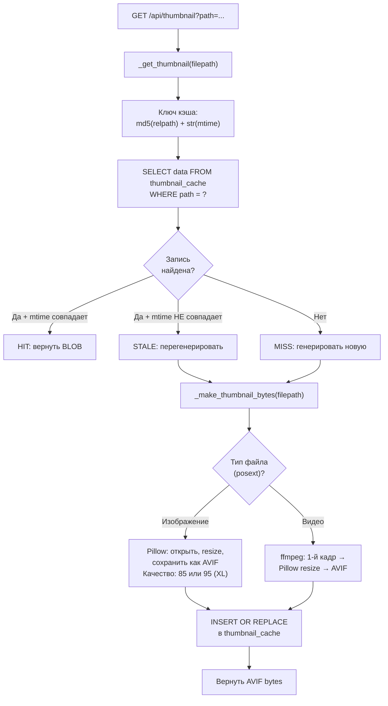

**Формат:** AVIF (был JPEG). AVIF даёт ~60-80% меньший размер при том же качестве.

**Debug-логирование (цветное):**
- `HIT` (зелёный) — превью найдено, mtime совпадает
- `MISS` (красный) — нет в кэше
- `STALE` (жёлтый) — mtime изменился, нужна перегенерация
- `GENERATED` (зелёный) — успешно создано (с таймингом)
- `FAILED` (красный) — ошибка генерации

**SSE-поток для регенерации** (`/api/regenerate_thumbnails/stream`):
```
event: progress
data: {"current": 42, "total": 100, "path": "...", "status": "GENERATED", "elapsed": 0.34}

event: done
data: {"generated": 98, "failed": 2, "total_elapsed": 34.2}
```

Отмена регенерации: `POST /api/cancel_regen` → устанавливает флаг `_thumb_regen_cancel`.

### 6. Декораторы (строки 1225-1275)

Три декоратора определены **до** всех роутов:

#### `_auth_required()` (строка 1225) — вспомогательная функция

```python
def _auth_required():
    if not session.get('authenticated'):
        return {'error': 'auth', 'message': 'Authentication required'}
    return None
```

#### `_admin_required()` (строка 1233)

```python
def _admin_required():
    if not session.get('authenticated'):
        return {'error': 'auth', 'message': 'Authentication required'}
    if session.get('role') != 'admin':
        return {'error': 'forbidden', 'message': 'Admin access required'}
    return None
```

#### `@auth_required(f)` (строка 1242)

```python
def auth_required(f):
    @wraps(f)
    def decorated_function(*args, **kwargs):
        if not session.get('authenticated'):
            return jsonify({'error': 'unauthorized'}), 401
        return f(*args, **kwargs)
    return decorated_function
```

Используется на **13** эндпоинтах (включая настройки пароля, username, API ключей, аккаунта).

#### `@admin_required(f)` (строка 1252)

```python
def admin_required(f):
    @wraps(f)
    def decorated_function(*args, **kwargs):
        if not session.get('authenticated'):
            return jsonify({'error': 'unauthorized'}), 401
        if session.get('role') != 'admin':
            return jsonify({'error': 'forbidden'}), 403
        return f(*args, **kwargs)
    return decorated_function
```

Используется на **72** эндпоинтах (70 API + 2 страницы: `/content-mgmt/comics-edit`, `/content-mgmt/comics-tags`).

#### `@api_error_handler(f)` (строка 1262)

```python
def api_error_handler(f):
    @wraps(f)
    def wrapper(*args, **kwargs):
        try:
            return f(*args, **kwargs)
        except Exception as e:
            log_error(f"API error in {f.__name__}: {e}")
            return jsonify({'error': str(e)}), 500
    return wrapper
```

Используется на **100** эндпоинтах. Единый формат ошибок: `{'error': str(e)}` с HTTP 500.

#### Правильный порядок декораторов (CRITICAL)

```python
# ПРАВИЛЬНО — декораторы работают:
@app.route('/api/thing')
@admin_required      # проверка auth + role
@api_error_handler   # try/except
def api_thing():
    ...

# НЕПРАВИЛЬНО — декораторы выше @app.route НЕ РАБОТАЮТ:
@admin_required
@api_error_handler
@app.route('/api/thing')
def api_thing():
    ...
```

Почему: Flask регистрирует функцию, которая стоит сразу после `@app.route`. Все декораторы **выше** `@app.route` оборачивают уже обёрнутую функцию — их код никогда не выполняется.

### 7. Auth middleware (строки 1907-1925)

#### `check_auth()` — `@app.before_request` (строка 1907)

Выполняется **перед каждым HTTP-запросом**:

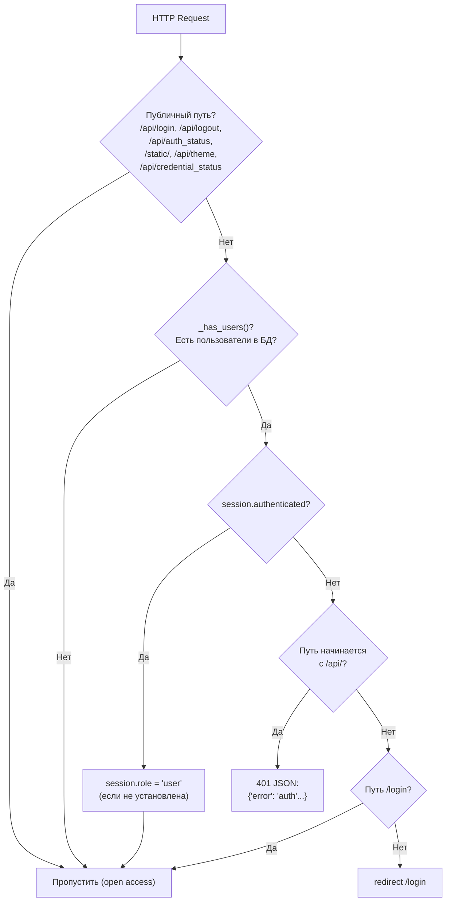

**Защищённые страницы** (редирект на `/login` если не аутентифицирован): `/settings`, `/content-mgmt/*`, `/admin`, `/tagfetch/*`.

**Важно:** middleware устанавливает `session.role = 'user'` для аутентифицированных пользователей без роли.

#### `log_access()` — `@app.after_request` (строка 1924)

Логирует каждый HTTP-запрос с цветом по статусу ответа:
```python
@app.after_request
def log_access(response):
    log_request(request.method, request.path,
                dict(request.args), response.status_code)
    return response
```

### 8. Startup scan (строки 1940-2014)

Функция `_quick_scan(force=False)` запускается в **daemon-потоке**:

1. **Fast check:** сравнивает количество файлов в `media_dir` (через `_count_media_files()`) с количеством записей в таблице `files`
2. Если числа совпадают — **SKIP** (ничего не делать)
3. Если отличаются — полный обход:
   - `os.walk` по `media_dir`
   - Пропускает скрытые директории (имя начинается с `.`) и скрытые файлы
   - Фильтрует по `_MEDIA_EXTS`
   - Для каждого нового файла: `INSERT OR IGNORE` с авто-тегами
4. Все INSERT'ы в **единой транзакции**
5. **Не использует Pillow** — `width`/`height` = 0 при вставке, запросы к API не делаются

### 9. Credential Store (`src/credential_store.py`, 122 строки)

Отдельный модуль для безопасного хранения API-ключей Rule34, Danbooru, NHentai и E-Hentai.

**Класс `KeyringStore`:**
- Обёртка над библиотекой `keyring`, service name: `'mediavault'`
- Методы: `is_available()`, `get(key)`, `set(key, value)`, `delete(key)`
- Fallback: `init_credential_store()` → `None` → ключи в `settings.json` (plain text)

**Переключение бэкенда:**
- `GET /api/credential_status` — текущий бэкенд + доступные варианты
- `POST /api/set_credential_backend` — миграция ключей между бэкендами

### 10. API endpoints (121 route, 14+ групп)

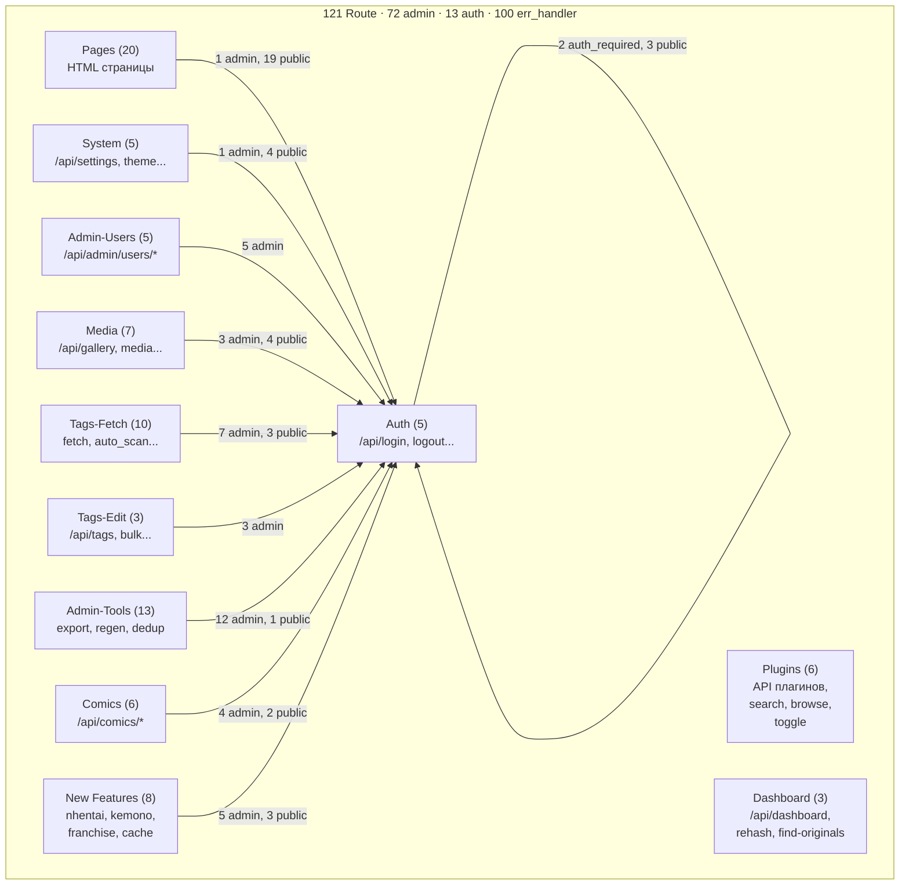

#### Pages (20) — HTML страницы

| Роут | Функция | Декораторы | Примечание |
|------|---------|------------|------------|
| `/` | `index()` | — | Главная: 3 блока (MV/CM/Admin), аккаунт-дропдаун |
| `/login` | `login_page()` | — | Username+password. Не `base.html`. Редирект если уже залогинен |
| `/mediavault/gallery` | `mediavault_gallery()` | — | Галерея: masonry/grid/list, lightbox, теги, поиск |
| `/mediavault/comics` | `mediavault_comics()` | — | Список комиксов (MV, read-only) |
| `/mediavault/view` | `mediavault_view()` | — | Просмотр файла: prev/next, теги, fullscreen |
| `/mediavault/comics/view` | `mediavault_comics_view()` | — | Редирект на `/comics/view` |
| `/popular-tags` | `popular_tags()` | — | Облако тегов |
| `/comics` | `comics_route()` | — | Редирект на `/mediavault/comics` |
| `/comics/view` | `comics_view()` | — | Ридер комиксов: scroll + lightbox |
| `/content-mgmt/tags-auto` | `cm_tags_auto()` | — | Tagfetch Auto (SSE). Admin-only рендер |
| `/content-mgmt/tags-manual` | `cm_tags_manual()` | — | Tagfetch Manual. Admin-only рендер |
| `/content-mgmt/tags-manage` | `cm_tags_manage()` | — | Управление тегами: Files + Groups |
| `/content-mgmt/tags-group` | `cm_tags_group()` | — | Только Groups/категории |
| `/content-mgmt/comics-edit` | `cm_comics_edit()` | `@admin_required` | Редактор комиксов |
| `/content-mgmt/comics-tags` | `comics_tags_page()` | `@admin_required` | Comics grid + category tags drag-to-tag |
| `/content-mgmt/search` | `content_search_page()` | `@admin_required` | Unified search (R34, Danbooru, NHentai, E-Hentai) |
| `/nhentai-search` | `nhentai_search_page()` | — | Поиск по NHentai (Feature 11) → редирект на /content-mgmt/search |
| `/franchise-search` | `franchise_search_page()` | — | Поиск по всем сайтам (Feature 8) → редирект на /content-mgmt/search |
| `/kemono-import` | `kemono_import_page()` | — | Страница импорта с Kemono (Feature 7) |
| `/similar` | `similar_page()` | — | Страница похожих файлов |
| `/settings` | `settings_page()` | — | 3 таба: Appearance, Database, Account |
| `/admin` | `admin_panel()` | — | Панель администратора (SPA) |
| `/favicon.ico` | `favicon()` | — | Inline SVG фавиконка |
| `/content-mgmnt` | `content_page_legacy()` | — | Редирект на `/content-mgmt/tags-manage` |

**Итого: 21 страница + favicon + 2 legacy redirect = 24 `@app.route`, 23 функции, 3 с `@admin_required`.**

#### System (5) — системные API

| Роут | Функция | Декораторы | Строка |
|------|---------|------------|--------|
| `GET/POST /api/settings` | `api_settings()` | `@api_error_handler` | 1563 |
| `GET /api/credential_status` | `api_credential_status()` | `@api_error_handler` | 1596 |
| `POST /api/set_credential_backend` | `api_set_credential_backend()` | `@admin_required`, `@api_error_handler` | 1605 |
| `POST /api/theme` | `api_theme()` | `@api_error_handler` | 1645 |
| `POST /api/effects` | `api_effects()` | `@api_error_handler` | 1658 |

`api_settings()` имеет ручную проверку admin внутри: GET — для всех, POST — только admin.

#### Auth (5) — аутентификация

| Роут | Функция | Декораторы | Строка |
|------|---------|------------|--------|
| `GET /api/auth_status` | `api_auth_status()` | `@api_error_handler` | 1690 |
| `POST /api/login` | `api_login()` | `@api_error_handler` | 1701 |
| `POST /api/logout` | `api_logout()` | `@api_error_handler` | 1729 |
| `POST /api/set_password` | `api_set_password()` | `@auth_required`, `@api_error_handler` | 1737 |
| `POST /api/account/change_username` | `api_account_change_username()` | `@auth_required`, `@api_error_handler` | 1760 |

#### Admin-Users (5) — управление пользователями

| Роут | Функция | Декораторы | Строка |
|------|---------|------------|--------|
| `GET /api/admin/users` | `api_admin_users()` | `@admin_required`, `@api_error_handler` | 1819 |
| `POST /api/admin/users` | `api_admin_add_user()` | `@admin_required`, `@api_error_handler` | 1832 |
| `DELETE /api/admin/users/<id>` | `api_admin_delete_user(id)` | `@admin_required`, `@api_error_handler` | 1855 |
| `POST /api/admin/users/<id>/role` | `api_admin_set_role(id)` | `@admin_required`, `@api_error_handler` | 1869 |
| `POST /api/admin/users/<id>/password` | `api_admin_set_password(id)` | `@admin_required`, `@api_error_handler` | 1889 |

#### Media (7) — медиа-контент

| Роут | Функция | Декораторы | Строка |
|------|---------|------------|--------|
| `GET /api/gallery` | `api_gallery()` | `@api_error_handler` | 2025 |
| `GET /api/media` | `api_media()` | `@api_error_handler` | 2125 |
| `GET /api/thumbnail` | `api_thumbnail()` | `@api_error_handler` | 2140 |
| `GET /api/fileinfo` | `api_fileinfo()` | `@api_error_handler` | 2158 |
| `GET /api/browse` | `api_browse()` | `@admin_required`, `@api_error_handler` | 2097 |
| `GET /api/pick_folder` | `api_pick_folder()` | `@admin_required`, `@api_error_handler` | 2075 |
| `POST /api/scan_folder` | `api_scan_folder()` | `@admin_required`, `@api_error_handler` | 2017 |

#### Tags-Fetch (10) — получение и сохранение тегов

| Роут | Функция | Декораторы | Строка |
|------|---------|------------|--------|
| `GET /api/fetch_file` | `api_fetch_file()` | `@admin_required`, `@api_error_handler` | 2207 |
| `POST /api/auto_status` | `api_auto_status()` | `@api_error_handler` | 2311 |
| `POST /api/check_status` | `api_check_status()` | `@api_error_handler` | 2356 |
| `POST /api/clear_cache` | `api_clear_cache()` | `@admin_required`, `@api_error_handler` | 2392 |
| `GET/POST /api/popular_tags` | `api_popular_tags()` | `@api_error_handler` | 2411 |
| `GET/POST /api/categories` | `api_categories()` | `@api_error_handler` | 2449 |
| `POST /api/save_file` | `api_save_file()` | `@admin_required`, `@api_error_handler` | 2533 |
| `POST /api/save_all_fetched` | `api_save_all_fetched()` | `@admin_required`, `@api_error_handler` | 2667 |
| `POST /api/auto_scan` | `api_auto_scan()` | `@admin_required`, `@api_error_handler` | 2758 |

**Приоритет `check_status`:** `db` > `found` > `not_found` > `no_tags`. Используется в `manual-v2.js` для расстановки `data-status` на `.path-item`.

#### Tags-Edit (3) — редактирование тегов

| Роут | Функция | Декораторы | Строка |
|------|---------|------------|--------|
| `POST /api/tags` | `api_tags()` | `@admin_required`, `@api_error_handler` | 3135 |
| `POST /api/tags/bulk` | `api_tags_bulk()` | `@admin_required`, `@api_error_handler` | 3167 |
| `POST /api/clear_tag_cache` | `api_clear_tag_cache()` | `@admin_required`, `@api_error_handler` | 3194 |

#### Admin-Tools (13) — инструменты администратора

| Роут | Функция | Декораторы | Строка |
|------|---------|------------|--------|
| `GET /api/export_db` | `api_export_db()` | `@admin_required`, `@api_error_handler` | 2929 |
| `POST /api/import_db` | `api_import_db()` | `@admin_required`, `@api_error_handler` | 2939 |
| `POST /api/clear_thumb_cache` | `api_clear_thumb_cache()` | `@admin_required`, `@api_error_handler` | 2962 |
| `POST /api/regenerate_thumbnails` | `api_regenerate_thumbnails()` | `@admin_required`, `@api_error_handler` | 2981 |
| `GET /api/regenerate_thumbnails_status` | `api_regen_status()` | `@api_error_handler` | 2993 |
| `POST /api/generate_missing_thumbnails` | `api_gen_missing()` | `@admin_required`, `@api_error_handler` | 3030 |
| `GET /api/regenerate_thumbnails/stream` | `api_regen_stream()` | `@admin_required`, `@api_error_handler` | 3042 |
| `POST /api/cancel_regen` | `api_cancel_regen()` | `@admin_required`, `@api_error_handler` | 3122 |
| `POST /api/clear_database` | `api_clear_database()` | `@admin_required`, `@api_error_handler` | 3216 |
| `POST /api/clear_all` | `api_clear_all()` | `@admin_required`, `@api_error_handler` | 3241 |
| `POST /api/clear_tags` | `api_clear_tags()` | `@admin_required`, `@api_error_handler` | 3256 |
| `POST /api/delete_all` | `api_delete_all()` | `@admin_required`, `@api_error_handler` | 3281 |
| `POST /api/deduplicate` | `api_deduplicate()` | `@admin_required`, `@api_error_handler` | 3315 |

#### Comics (6) — комиксы

| Роут | Функция | Декораторы | Строка |
|------|---------|------------|--------|
| `GET /api/comics/search` | `api_comics_search()` | `@admin_required`, `@api_error_handler` | 3355 |
| `GET /api/comics/list` | `api_comics_list()` | `@api_error_handler` | 3380 |
| `POST /api/comics/add` | `api_comics_add()` | `@admin_required`, `@api_error_handler` | 3400 |
| `POST /api/comics/delete` | `api_comics_delete()` | `@admin_required`, `@api_error_handler` | 3428 |
| `POST /api/comics/get` | `api_comics_get()` | `@api_error_handler` | 3449 |
| `POST /api/comics/update` | `api_comics_update()` | `@admin_required`, `@api_error_handler` | 3476 |

### Итоговая сводка

| Группа | Роутов | `@admin_required` | `@auth_required` | `@api_error_handler` |
|--------|--------|--------------------|------------------|----------------------|
| Pages (HTML) | 21 | 3 | 0 | 0 |
| System | 5 | 1 | 0 | 5 |
| Auth | 5 | 0 | 2 | 5 |
| Admin-Users | 5 | 5 | 0 | 5 |
| Media | 7 | 3 | 0 | 7 |
| Tags-Fetch | 10 | 7 | 0 | 10 |
| Tags-Edit | 3 | 3 | 0 | 3 |
| Admin-Tools | 13 | 12 | 0 | 13 |
| Comics | 6 | 4 | 0 | 6 |
| New Features | 8 | 5 | 0 | 8 |
| Content Search | 5 | 1 | 4 | 5 |
| Dashboard | 3 | 2 | 0 | 3 |
| Plugins | 6 | 4 | 0 | 4 |
| **Всего** | **~121** | **~72** | **~13** | **~100** |

### Контекстные процессоры

Два `@app.context_processor` автоматически injectят переменные во **все** Jinja2-шаблоны:

**`inject_i18n` (строка 549):**
- `_()` — функция перевода из LOCALE по ключу
- `lang` — текущий язык из куки `mediavault_lang`

**`inject_media_vars` (строка 556):**
- `media_dir_exists` — `bool`: настроена ли медиа-директория
- `media_dir_empty` — `bool`: есть ли файлы в ней
- `lang` — дублируется из `inject_i18n`

## 7. Фронтенд: шаблоны, JS-модули, CSS и i18n

> **Планируется миграция на TypeScript (Svelte 5 + Hono + Bun).** Полный план: [`docs/TECH-STACK-REVIEW.md`](TECH-STACK-REVIEW.md). Новые фичи рекомендуется сразу делать в TS-стеке.

### 7.1 Архитектура шаблонов

Все страницы, кроме `/login`, наследуют `base.html` через ``. Это даёт общий скелет: `<head>` с CONFIG JSON, CSS, JS, хедер, футер.

#### 17 шаблонов (~3010 строк)

| Файл | Строк | Роут |
|------|-------|------|
| templates/base.html | 343 | Shell, CONFIG JSON, CSS/JS links, header blocks |
| templates/settings.html | 596 | Settings с 3 табами (Appearance/Database/Account) |
| templates/shared/view.html | 421 | Fullscreen viewer + comics reader |
| templates/home.html | 386 | Home page 3 блока, Three.js bg |
| templates/login.html | 177 | Login (standalone, не base.html), Three.js bg |
| templates/shared/gallery.html | 152 | Gallery + lightbox |
| templates/content-search.html | 138 | Content search page (R34, Danbooru, NHentai, E-Hentai, HentaiLive) |
| templates/kemono_import.html | 138 | Kemono import page |
| templates/shared/comics-list.html | 117 | Comics list (MV view + CM edit modes) |
| templates/tagfetch/auto.html | 122 | Auto tagfetch (SSE) |
| templates/nhentai_search.html | 110 | NHentai search page |
| templates/tagfetch/manual.html | 102 | Manual tagfetch |
| templates/admin/admin.html | 61 | Admin SPA (6 разделов: Dashboard, Users, DB, API Keys, Scan, Mount, Plugins) |
| templates/similar.html | 47 | Similar files page |
| templates/shared/macros.html | 41 | 2 Jinja2-макроса (password_field, theme_buttons) |
| templates/shared/popular_tags.html | 31 | Popular tags |
| templates/content-mgmt/tags.html | 28 | Tags management + Comics Tags |

#### `base.html` — скелет страницы

`base.html` (349 строк) содержит:

- **CONFIG JSON** — в `<head>`, блок `<script id="appConfig" type="application/json">`: page name, subview, настройки, i18n словарь, lang. Все JS-модули читают `CONFIG.page` чтобы решить, инициализироваться или нет.
- **CSS** — подключает `shared.css`, `tagfetch.css`, `mediavault.css` всегда. `admin.css` — на страницах admin/settings. `content.css` — только для `/content-mgmt/`.
- **JS** — IIFE-файлы загружаются в `` внизу `body` (не блокирует рендер). ES-модули (Content Manager и shared) — отдельные `<script type="module">` теги.
- **Блоки Jinja2 для хедера**: `hdr_brand` (логотип), `hdr_tabs` (навигационные вкладки), `hdr_nav` (ссылки), `hdr_actions` (кнопки темы/языка), `hdr_search` (строка поиска), `hdr_drawer` (мобильное меню).
- **Два хедера**: десктопный `.hdr-desktop` и мобильный `.hdr-mobile`. Показываются/скрываются через CSS media queries (768px breakpoint). **Никакого `window.innerWidth` в JS.**
- **Макросы**: `` — макрос рендерит кнопки темы (SVG солнце/луна) и языка (RU/EN).
- **Importmap**: `<script type="importmap">{"imports": {"three": "/static/lib/three.module.js"}}</script>` — для Three.js на home и login.

#### login.html — исключение

`login.html` **не** наследует `base.html`. Это standalone-страница: свой `<html>`, свой `<head>`, свой CSS. Использует Three.js фон + стеклянную карточку логина. Редиректит на `/` если пользователь уже залогинен.

#### Jinja2-макросы (shared/macros.html)

2 макроса, импортируются с `with context`:
| Макрос | Назначение |
|--------|-----------|
| `password_field()` | Поле пароля с eye-toggle (показать/скрыть) |
| `theme_buttons()` | Кнопка темы (SVG sun/moon) + кнопка языка (RU/EN) |

Остальные макросы (`sort_btn`, `close_svg`, `loading_spinner`, `view_btn`) удалены — их функциональность перенесена в inline SVG в шаблонах.

#### Контекстный процессор `inject_media_vars`

`@app.context_processor` автоматически injectит в **каждый** Jinja2-шаблон:
- `media_dir_exists` — bool: настроена ли медиа-директория
- `media_dir_empty` — bool: есть ли файлы в ней
- `lang` — текущий язык из куки `mediavault_lang`

---

### 7.2 JS-модули: архитектура и init-флоу

#### Два паттерна модулей

В проекте 33 JS-файла (без lib/). 22 используют IIFE (Immediately Invoked Function Expression) с глобальным `window.*` API. 11 используют ES-модули (с `import`/`export`).

**IIFE-паттерн (22 файла):**

```javascript
var MediaVaultGallery = (function() {
    var _galleryData = [];
    
    function init() { ... }
    function loadGallery() { ... }
    
    return {
        init: init,
        loadGallery: loadGallery
    };
})();

// Экспорт в window для onclick в HTML
window.MediaVaultGallery = MediaVaultGallery;
```

Приватные переменные (`_galleryData`) не видны снаружи. Публичный API — через `return { ... }`. Функции дублируются в `window.*` для `onclick`-атрибутов в шаблонах:

```html
<button onclick="MediaVaultGallery.loadGallery()">Load</button>
```

**ES-модули (11 файлов):**
- `content/` — Content Manager: `main.js`, `tags.js`, `tags-manage/tags-manage.js`, `comics.js`, `comics-tags.js`, `content-search.js`, `nhentai_search.js`, `utils.js`
- `shared/grid-renderer.js` — Render сеток для comics-tags, tags-manage
- `shared/comics/comics-search.js` — Поиск по комиксам
- `shared/comics/picker-bridge.js` — ES-мост для ComicsPicker
- `shared/home-bg.js` — Three.js фон (импортирует `'three'` через importmap)

**Важно:** `shared-grid.js` — IIFE, не ES-модуль (использует `var SharedGrid = ...`).
- `shared/comics/picker-bridge.js` — мост для ComicsPicker из ES в IIFE

ES-модули загружаются через `<script type="module" src="...">` и могут `import` друг друга. IIFE-файлы — через обычные `<script src="...">` (глобальный порядок).

#### 33 JS-файла (~10580 строк, без three.module.js)

**shared/ (9 файлов, ~3068 строк):**

| Файл | Строк | Назначение |
|------|-------|-----------|
| static/shared/lightbox.js | 1127 | Fullscreen viewer, zoom, swipe, keyboard nav, tag panel |
| static/shared/utils.js | 1071 | i18n словари (274 ключа), layout, Shared.* namespace |
| static/shared/find-originals.js | 428 | Find Originals модал (IIFE, два столбца) |
| static/shared/grid-renderer.js | 149 | ES-модуль: render сеток для comics-tags, tags-manage |
| static/shared/home-bg.js | 145 | Three.js background для home/login (ES module) |
| static/shared/init.js | 101 | Entry point: drawer, banner, page init |
| static/shared/mobile-search.js | 84 | MobileSearch (IIFE) |
| static/shared/api.js | 37 | Базовый fetch GET/POST/POST upload |
| static/shared/icons.js | 26 | Site icons: Rule34, Danbooru, NHentai, E-Hentai, Kemono, Coomer |

**shared/gallery/ (3 файла, 1177 строк):**

| Файл | Строк | Назначение |
|------|-------|-----------|
| static/shared/gallery/gallery.js | 857 | Gallery load, filter, pagination, sort, popular tags |
| static/shared/gallery/tags.js | 224 | Tag UI + categories, cat cache |
| static/shared/gallery/lightbox.js | 96 | Lightbox wrapper, делегирует в Shared |

**shared/grid/ (1 файл, 140 строк):**

| Файл | Строк | Назначение |
|------|-------|-----------|
| static/shared/grid/shared-grid.js | 140 | Shared grid renderer для comics (IIFE) |

**shared/comics/ (4 файла, 789 строк):**

| Файл | Строк | Назначение |
|------|-------|-----------|
| static/shared/comics/comics.js | 554 | ComicsPicker: cpageGrid, preview, DnD |
| static/shared/comics/comics-list.js | 117 | Comic grid render для MV view mode |
| static/shared/comics/comics-search.js | 65 | Поиск по комиксам |
| static/shared/comics/picker-bridge.js | 53 | ES module bridge для ComicsPicker |

**mediavault/ (3 файла, 360 строк):**

| Файл | Строк | Назначение |
|------|-------|-----------|
| static/mediavault/mediavault.js | 287 | Orchestrator для MV subapp |
| static/mediavault/api.js | 47 | API calls |
| static/mediavault/db.js | 26 | DB operations |

**content/ (8 файлов, 2233 строки, ES modules):**

| Файл | Строк | Назначение |
|------|-------|-----------|
| static/content/content-search.js | 957 | Unified search (R34, Danbooru, NHentai, E-Hentai, HentaiLive) |
| static/content/tags-manage/tags-manage.js | 500 | Files, masonry, lightbox |
| static/content/tags.js | 236 | Tag categories CRUD |
| static/content/comics-tags.js | 240 | Comics grid + category tags, drag-to-tag |
| static/content/nhentai_search.js | 180 | NHentai search (individual page) |
| static/content/comics.js | 215 | Comics CRUD |
| static/content/main.js | 107 | Entry point (ES module), section router |
| static/content/utils.js | 51 | Shared utilities, fallback к Shared.* |

**admin/ (1 файл, 1306 строк):**

| Файл | Строк | Назначение |
|------|-------|-----------|
| static/admin/admin.js | 1306 | AdminDashboard SPA (mount monitoring, scan progress, 6 разделов: Dashboard, Users, DB, API Keys, Scan, Mount, Plugins) |

**tagfetch/ (4 файла, 1156 строк):**

| Файл | Строк | Назначение |
|------|-------|-----------|
| static/tagfetch/manual/manual-v2.js | 648 | Manual tag fetch + file browser |
| static/tagfetch/auto/auto.js | 395 | Auto tag fetch (SSE) |
| static/tagfetch/api.js | 96 | Tagfetch API calls |
| static/tagfetch/tagfetch.js | 17 | URL tab detection |

#### Init-флоу

1. Браузер загружает `base.html` → CONFIG JSON в `<head>`
2. Все CSS-файлы загружаются (блокируют рендер)
3. Все JS-файлы загружаются в `` внизу `body`
4. `shared/init.js` — первый исполняемый скрипт. Читает `CONFIG.page`:
   - `'mediavault-gallery'` → `MediaVaultGallery.init()`
   - `'mediavault-comics'` → `MediaVaultComics.init()`
   - `'tagfetch-manual'` → `ManualTagFetch.init()`
   - `'settings'` → SettingsApp инициализируется инлайн
   - `'admin'` → `AdminDashboard.init()`
5. Content Manager — ES-модуль, `content/main.js` сам определяет subview и инициализирует нужный раздел (tags/files/comics)

Вся коммуникация между модулями — через `window.Shared.*` или глобальные переменные. Никаких событий/CustomEvents (кроме `languageChanged`).

---

### 7.3 Shared.* — единый набор утилит

Все модули делегируют общие функции в `Shared.*` (определены в `shared/utils.js`):

| Метод | Описание |
|-------|----------|
| `Shared.hexToRgba(hex, alpha)` | HEX → `rgba()` — единый source of truth (был в 4 копиях) |
| `Shared.parseTags(str)` | Разбор строки тегов через запятую → массив |
| `Shared.getColumnCount(gallery)` | Чтение `columnWidth` из computed style элемента |
| `Shared.reorderGalleryDOM(gallery, itemSelector)` | Транспонирование DOM для masonry: row-major → column-major |
| `Shared.getVisualOrder(gallery, itemSelector)` | Сортировка по `getBoundingClientRect()` (top → left) для счётчика `lb-pos` |
| `Shared.toggleTheme(btn)` | Переключение dark/light со spin-анимацией |
| `Shared.toggleLang()` | Переключение en/ru без перезагрузки |
| `Shared.applyI18n()` | Обновление всех `[data-i18n]` атрибутов |
| `Shared.formatSize(bytes)` | Форматирование размера: B/KB/MB/GB |
| `Shared.esc(s)` | Экранирование HTML |
| `Shared.notify(msg, type)` | Toast-уведомление |
| `Shared.t(key)` | i18n перевод на клиенте |
| `Shared.logout()` | POST /api/logout → редирект на / |
| `Shared.openComicsPicker(mode)` | Открыть ComicsPicker модал |

ES-модули (content/) имеют свои обёртки с fallback на `window.Shared`:

```javascript
// content/utils.js
export function hexToRgba(hex, alpha) {
    return window.Shared ? window.Shared.hexToRgba(hex, alpha) : /* fallback */;
}
```

IIFE-модули просто присваивают: `var hexToRgba = Shared.hexToRgba;`

---

### 7.4 CSS-архитектура

#### 8 CSS-файлов (2960 строк)

| Файл | Строк | Назначение |
|------|-------|-----------|
| static/css/content.css | 788 | CM: tags drag-drop, files, comics, comics-tags |
| static/css/admin.css | 646 | Admin cards, tables, modals, mount indicator, toggle-switch |
| static/css/content-search.css | 352 | Content search: search bar, grid, mobile override |
| static/css/shared.css | 339 | CSS vars, themes, base, header, mobile |
| static/css/mediavault.css | 335 | Gallery, lightbox, comics, sidebar |
| static/css/tagfetch.css | 248 | Tagfetch sidebar, preview panels |
| static/css/settings.css | 179 | Settings tabs, cards, DB grid, mount indicator |
| static/css/shared-grid.css | 73 | Shared grid: кастомные сетки комиксов |

Порядок загрузки (важен для специфичности, **никакого `!important`**):
1. `shared.css` — базовые стили, переменные
2. `tagfetch.css` — оверрайды для tagfetch
3. `mediavault.css` — галерея, лайтбокс, comics, header, mobile оверрайды
4. `admin.css` — admin panel (через `head_extra` блока), включает mount indicator styles
5. `content.css` — только для `/content-mgmt/*` (через условный блок)
6. `content-search.css` — в `content-search.html` (шаблон для `/content-mgmt/search`)
7. `settings.css` — только для `/settings`, также содержит mount indicator styles (дублированы из admin.css для независимой работы)

#### CSS-переменные (system)

```css
:root {
    --radius: 8px;
    --font: 'Manrope';
    --lb-panel-w: 300px;
    --thumb-col-width: 220px;
    /* z-index — 5 уровней */
    --z-dropdown: 100;
    --z-sticky: 150;
    --z-overlay: 1000;
    --z-modal: 5000;
    --z-toast: 10000;
    /* RGBA для оверлеев */
    --overlay: rgba(0,0,0,.5);
    --shadow: rgba(0,0,0,.15);
}
```

#### Темы: data-theme на `<html>`

Нет отдельных файлов тем. Всё через CSS custom properties:

```css
:root {
    --bg: #f5f5f5;
    --surface: #ffffff;
    --text: #1a1a1a;
    --accent: #4a90d9;
}
[data-theme="dark"] {
    --bg: #121212;
    --surface: #1e1e1e;
    --text: #e0e0e0;
    --accent: #64b5f6;
}
```

Переключение: `Shared.toggleTheme(btn)` → меняет `data-theme` на `<html>`, отправляет `POST /api/theme` для сохранения. Кнопка имеет spin-анимацию (класс `.btn-spin`, анимация `spin360` 0.5s).

#### Effects toggle: data-no-effects

Атрибут `data-no-effects` на `<html>` отключает анимации, transitions и backdrop-filter. Управляется через `POST /api/effects`. Используется слабыми машинами и в `prefers-reduced-motion`.

#### Responsive: десктоп → мобила

Единый breakpoint: **768px**. Мобильные стили — оверрайды в `shared.css` и `mediavault.css`. Никакого `window.innerWidth` в JS.

| Компонент | Десктоп (≥768px) | Мобильный (<768px) |
|-----------|-----------------|-------------------|
| Header | `.hdr-desktop` (flex, полная навигация) | `.hdr-mobile` (2 строки: бренд + гамбургер/поиск) |
| Sidebar | 260px слева, виден | `display: none` |
| Gallery | 3-4 колонки (masonry) | 2 колонки |
| Lightbox | Горизонтально (media слева, панель справа) | Вертикально (media сверху, панель снизу) |
| Nav zones | Скрыты | Показаны (35% слева/справа для тапа) |
| Drawer | Скрыт | Dropdown с `max-height` анимацией |

**Десктоп-элементы** помечены классом `.desktop-only` и скрыты на мобиле через CSS. Мобила **не получает** HTML для сайдбара, панели поиска и toolbar controls — они генерируются только в `.hdr-desktop` блоке.

---

### 7.5 Three.js фон

**Shared модуль:** `static/shared/home-bg.js` (145 строк, ES module)

```javascript
export function initHomeBg(opts) {
    // opts.container — DOM элемент
    // opts.colors — { accent, hover }
    // opts.beforeRender — хук для кастомной логики
}
```

- **Three.js:** self-hosted `static/lib/three.module.js` (v0.160.0, 53044 строк)
- **Где используется:** `home.html` и `login.html`
- **Importmap** во всех шаблонах: `"three": "/static/lib/three.module.js"` — работает без интернета
- **Тоггл:** настройка `three_bg` в settings.json. Отдельно от CSS effects toggle.
- **data-three-bg:** атрибут `data-three-bg="0"` на `<html>` скрывает Three.js canvas через MutationObserver
- **home.html:** ACCENT_MAP для цветов блоков (MediaVault/ContentManagement/Admin), hover меняет цвет dots
- **login.html:** Тёмный фон с точками, hover на Sign In → dots перекрашиваются в accent цвет

---

### 7.6 i18n: два языка

#### Как работает

```
Сервер (LOCALE словарь)
    ↓ Кука mediavault_lang
Jinja2: _('key') → текст в HTML
    ↓ data-i18n атрибуты
JS: window._i18nData → Shared.t('key') → подстановка через applyI18n()
```

1. Сервер читает куку `mediavault_lang` (en/ru)
2. В Jinja2-шаблоне доступна глобальная функция `_(key)` — возвращает перевод из `LOCALE` (548 ключей, 274 en + 274 ru)
3. HTML атрибуты: `data-i18n="key"`, `data-i18n-title="key"`, `data-i18n-placeholder="key"`
4. JS: `window._i18nData` — тот же словарь переводов, встроенный в CONFIG JSON
5. `Shared.applyI18n()` — находит все `[data-i18n]` и подставляет текст
6. `Shared.toggleLang()` — меняет куку, обновляет `data-i18n`, шлёт CustomEvent `languageChanged`

#### Shared.toggleLang() — живое переключение

```javascript
Shared.toggleLang = function() {
    var newLang = CONFIG.lang === 'en' ? 'ru' : 'en';
    document.cookie = 'mediavault_lang=' + newLang + ';path=/';
    CONFIG.lang = newLang;
    Shared.applyI18n();
    document.dispatchEvent(new CustomEvent('languageChanged'));
};
```

Модули подписываются на `languageChanged` для перерисовки UI:

```javascript
document.addEventListener('languageChanged', function() {
    renderUI();
});
```

#### Как добавить новую строку перевода

1. Добавить в `LOCALE` на сервере (web_app.py, оба языка)
2. Добавить в `window._i18nData` на клиенте (shared/utils.js)
3. В HTML: `data-i18n="myKey"` + `{{ _('myKey') }}`
4. В JS: `Shared.t('myKey')`

---

## 8. Таб «Tagfetch» (загрузка тегов)

### Что делает

Позволяет загрузить теги для файла(ов) с Rule34.xxx и Danbooru, используя MD5-хеш.

### Маршруты (Content Management)

В рамках F29, Tagfetch переехал под `/content-mgmt/`:

- `/content-mgmt/tags-auto` → TagFetch Auto (SSE)
- `/content-mgmt/tags-manual` → TagFetch Manual (браузер файлов)
- `/content-mgmt/tags-manage` → Files + Groups вкладки
- `/content-mgmt/tags-group` → Только Groups/категории

**Старые URL** `/tagfetch/manual` и `/tagfetch/auto` и `/tagfetch` — удалены. Теперь все tagfetch-роуты — под `/content-mgmt/`.

### Изменение вкладок

Раньше было через JS (`Tagfetch.switchTab()`) с hash-навигацией. Теперь отдельные URL:

- `/content-mgmt/tags-manual` → активна Manual
- `/content-mgmt/tags-auto` → активна Auto

**Как это реализовано:**

1. **Сервер** (web_app.py, ~1504-1539): 4 отдельных роута для auto, manual, manage, group
2. **Шаблоны**: `tagfetch/manual.html` / `tagfetch/auto.html` — табы — это `<a>`-ссылки с Jinja2-проверкой
3. **JS** (tagfetch.js): упрощён до `getCurrentTab()` — определяет вкладку из URL
4. **init.js**: инициализируется только то, что нужно

### Ручной режим (Manual)

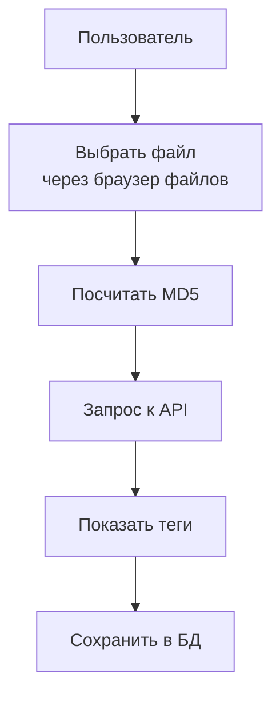

### Структура файлов tagfetch

```
static/tagfetch/
├── tagfetch.js        ← getCurrentTab() — определение вкладки из URL
├── api.js             ← API-вызовы (autoStatus, autoScan)
├── manual/manual-v2.js← Ручной режим (выбор 1 файла, API) + файловый браузер
└── auto/auto.js       ← Авто-режим (SSE, сетка карточек)
```

### Пустой state в файловом браузере

Файловый браузер показывает понятные сообщения: "Media directory is not set", "No media files found", "No files found matching your search".

Реализовано в `manual-v2.js` — `loadBrowser()` проверяет `settings.media_dir` и длину списка файлов.

### Откуда данные

1. **Rule34.xxx:** `https://api.rule34.xxx/index.php?page=dapi&s=post&q=index&md5=...` → XML
2. **Danbooru:** `https://danbooru.donmai.us/posts.json?md5=...` → JSON (с тегами и категориями)

Результаты кэшируются в `_api_cache` и `_md5_cache` (in-memory, теряются при рестарте).

### Фильтры в ручном режиме (Manual)

В `manual-v2.js` есть кнопки фильтра: All, No Tags, Found, Not Found, In DB.

```javascript
function setFilter(mode) {
    _filterMode = mode;
    document.querySelectorAll('.filter-btn').forEach(function(b) {
        b.classList.toggle('active', b.dataset.filter === mode);
    });
    applyFilter();
}
```

### Приоритет статуса файла (`/api/auto_status` и `/api/check_status`)

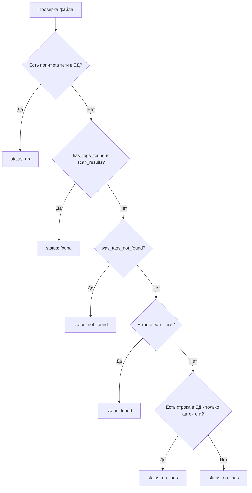

---

## 9. Таб «MediaVault» (галерея + lightbox)

### Галерея

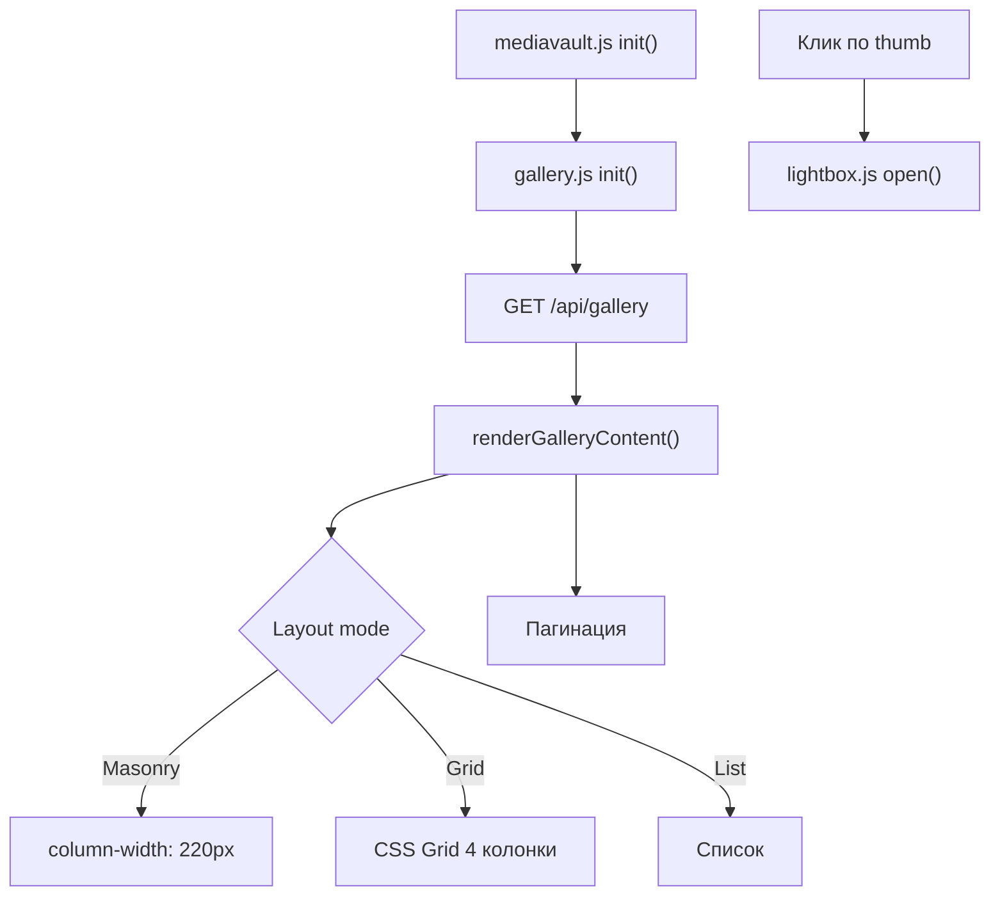

Галерея поддерживает:
- **Masonry** (по умолчанию) — как Pinterest, CSS `column-width`
- **Grid** — ровная сетка, CSS Grid
- **List** — список с превью
- **Поиск** по тегам (через запятую, `-тег` исключает)
- **Фильтр по категориям**
- **Режим отбора** (select mode) — выбрать несколько и добавить теги массово (admin)
- **Fetched only** — показать только файлы у которых есть теги из API
- **Сортировка по дате** — 3 режима: по имени, сначала новые, сначала старые
- **Пагинация** — через page_size localStorage

### Лайтбокс

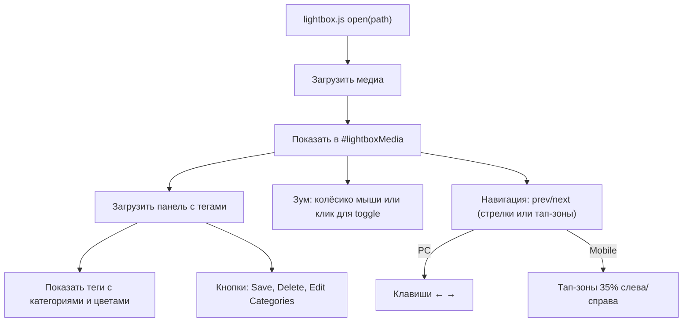

**Что можно делать в лайтбоксе:**
- Зум (колесо мыши с Ctrl / клик по картинке)
- Скролл-режим (для длинных картинок)
- Полноэкранный режим
- Изменять/добавлять теги
- Удалять файл (admin)
- Навигация по файлам

**Позиционный счётчик:** `lb-pos` показывает визуальный порядок (через `getVisualOrder()`), а не data-array порядок — критично для masonry.

### Тегирование

Система тегов вдохновлена Danbooru:

```
artist:some_artist, character:some_char, copyright:series, general:tag1 tag2, meta:rating:safe
```

Категории:
- **artist** — художник
- **character** — персонаж
- **copyright** — серия/франшиза
- **general** — общие теги
- **meta** — мета-теги (rating:safe, etc.)

Каждая категория имеет цвет. Категории можно создавать/удалять через UI.

### Как сохраняются теги

1. **`/api/save_file`** — сохранить теги для одного файла (с `source='both'`)
2. **`/api/save_all_fetched`** — сохранить всё что нашлось в авто-скане

Все три записывают только если `_has_non_meta_tags()` вернула `True`.

---

## 10. Comics — создание и просмотр комиксов

### Архитектура

Comics — это отдельная подсистема со своими страницами, API и JS-модулями.

```
Views:
├── shared/comics-list.html  ← Список комиксов (mode=view — MV, mode=edit — CM)
├── shared/view.html         ← Ридер комиксов (mode=comics, scroll + lightbox)
└── shared/gallery.html      ← В MV gallery есть comics tabs + comics modal

JS:
├── shared/comics/comics.js        ← Файловый браузер ComicsPicker (cpGrid, preview, DnD)
├── shared/comics/comics-list.js   ← Список комиксов для CM mode
├── shared/comics/picker-bridge.js ← ES-мост для ComicsPicker
└── content/comics.js              ← CRUD комиксов

API (все в web_app.py):
├── /api/comics/list     ← GET — список всех комиксов
├── /api/comics/add      ← POST — создание нового комикса
├── /api/comics/get      ← POST — страницы комикса по id
├── /api/comics/delete   ← POST — удаление комикса
├── /api/comics/update   ← POST — обновление (название, страницы, обложка)
└── /api/comics/search   ← GET — поиск по названию

DB:
├── comics              ← id, title, cover_path
└── comic_pages         ← id, comic_id, page_number, file_path
```

### ComicsPicker — единый компонент для MV и CM

ComicsPicker — это модал с двумя колонками для выбора страниц комикса:
- **Слева:** cpageGrid — файловый браузер с поиском, превью при наведении, сортировкой по дате
- **Справа:** preview panel (COMICS MAP) — выбранные файлы с превью, drag-and-drop для сортировки, кнопка обложки

Используется:
- **MV** (`/mediavault/comics`): `mode='view'`, админ видит кнопку «Add Comic» с модалом
- **CM** (`/content-mgmt/comics-edit`): `mode='edit'`, полное управление через `content/comics.js`

### cpGrid — файловый браузер для выбора страниц

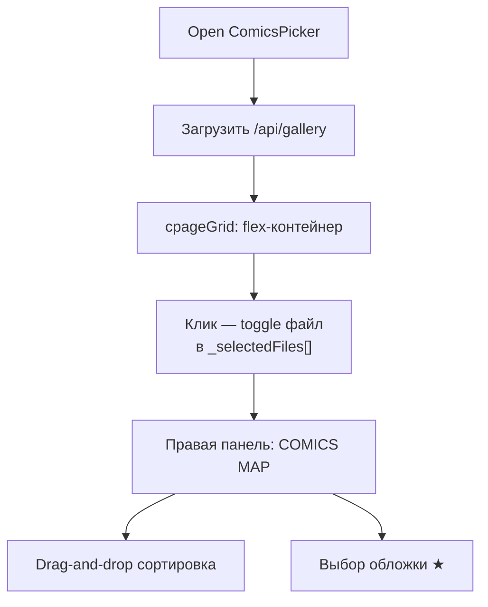

### Ридер комиксов

**Spread mode (по умолчанию):**
- Две страницы рядом (спред), строго на весь экран — `calc(100vh - 44px)`
- Изображения `object-fit: contain` внутри своих половин
- Навигация: ← → или PgUp/PgDn — по спредам (2 страницы за раз)
- Счётчик внизу показывает `"1-2 / 200"` (левая-правая / всего)
- Переключение в lightbox через кнопку или клавишу `F`
- Работает на всех экранах (десктоп + мобильный)

**Lightbox mode:**
- Одна страница на весь экран
- Навигация: ← → или PgUp/PgDn (по 1 странице), тап-зоны по бокам
- Переключение в scroll через кнопку или клавишу `F`

### API endpoints

`GET /api/comics/list` — возвращает JSON-массив комиксов:
```json
[
  {"id": 1, "title": "My Comic", "cover_path": "/path/to/cover.jpg", "page_count": 12}
]
```

`POST /api/comics/add` — создаёт комикс:
```json
{"title": "My Comic", "paths": ["/media/001.jpg", "/media/002.jpg"], "cover_path": "/media/001.jpg"}
```

`POST /api/comics/get` — возвращает страницы:
```json
{"comic": {"id": 1, "title": "..."}, "pages": [{"id": 1, "page_number": 1, "file_path": "..."}]}
```

---

## 11. Hover preview (cpagePreview)

### Как работает

При наведении на элемент `.cpage-item` в cpageGrid появляется **полноразмерное превью** — большая картинка рядом с иконкой файла. Реализовано в `comics.js`:

```
Mouse over .cpage-item
    ↓ (300ms delay)
_schedulePreview(item):
    ↓
1. Определить размер: ширина × height × scale (2.4)
2. Для изображений: сохранить aspect ratio из fileData.width/height
3. Для видео: set width/height, добавить <video> с controls
4. Позиционировать: справа от элемента (или слева если не влезает)
5. Показать #cpagePreview с классом .show
    ↓
Mouse leaves .cpage-item → 400ms таймер
    ↓
Mouse enters #cpagePreview → cancel таймер (preview остаётся)
    ↓
Mouse leaves #cpagePreview → 400ms таймер → _hidePreview()
```

**Ключевые моменты:**
- Задержка 300ms перед показом — чтобы не дёргать при быстром скролле
- Задержка 400ms перед скрытием — чтобы курсор успел дотянуться от иконки до preview
- Preview остаётся видимым при наведении на него (можно взаимодействовать с видео-контролами)
- Для видео: `<video autoplay muted loop playsinline controls>` — сразу начинает воспроизводиться
- Для картинок: `` — полноразмерное изображение (не превью)

---

## 12. Sort System — сортировка по дате

### Где реализовано

| Место | Файл | Переменная | Функция |
|-------|------|-----------|---------|
| MediaVault Gallery | `gallery.js` | `_sortMode` | `toggleDateSort()` |
| Comic modal (cpGrid) | `comics.js` | `_cpSortMode` | `toggleDateSort()` |
| Tagfetch Manual sidebar | `manual-v2.js` | `_tfSortMode` | `toggleDateSort()` |

### Три состояния

```javascript
var modes = ['name', 'newest', 'oldest'];
```

1. **name** — сортировка по имени (по умолчанию)
2. **newest** — сначала новые (mtime DESC)
3. **oldest** — сначала старые (mtime ASC)

### Как работает переключение

```javascript
function toggleDateSort() {
    var modes = ['name', 'newest', 'oldest'];
    var idx = modes.indexOf(_sortMode);
    _sortMode = modes[(idx + 1) % modes.length];
    var btn = document.getElementById('sortDateBtn');
    btn.innerHTML = svg + ' <span>' + Shared.t(modeKey) + '</span>';
    btn.title = Shared.t(titleKey);
    loadGallery();
}
```

---

## 13. Мобильный хедер и drawer

### Где реализовано

| Компонент | Файл | Описание |
|-----------|------|----------|
| HTML хедера | `templates/base.html` | `.hdr-desktop` + `.hdr-mobile` блоки |
| CSS | `static/css/shared.css` | `.hdr-desktop`, `.hdr-mobile`, `.mv-drawer` |
| Drawer toggle | `static/shared/init.js` | `mobileMenuBtn` click / Escape key |
| Drawer sync | `gallery.js` | `toggleFetchedOnly()`, `toggleDateSort()` |
| Mobile search sync | `mediavault.js` | `#searchInputMobile` ↔ `#searchInput` |

### Как работает

Мобильный хедер показывается на всех страницах, кроме `/`. CSS: при 768px `.hdr-desktop` скрывается, `.hdr-mobile` показывается.

**Row 1:** название бренда + навигационные иконки + кнопки темы/языка + Home
**Row 2:** гамбургер + поиск (синхронизируется с сайдбаром)

**Drawer (выпадашка):** открывается при клике на гамбургер — dropdown внутри row2 с анимацией `max-height`:
```css
.mv-drawer { max-height: 0; transition: max-height .35s ease; }
.mv-drawer.open { max-height: 400px; }
```

Содержимое drawer:
- **Layout** — кнопки: Columns (Masonry), Grid, List
- **Page size** — кнопки: All, 30, 60, 90
- **Sort** — кнопка сортировки по дате
- **Filter** — кнопка "Tagged" (fetched only)

### Почему не сайдбар

Drawer сделан как dropdown (не sidebar) чтобы:
- Не занимать место на маленьком экране
- Не нужен overlay (click-away) — проще UX
- Анимация `max-height` дешевле и плавнее

---

## 14. Как добавлять новую фичу

> **Планируется переезд на TypeScript.** См. [`docs/TECH-STACK-REVIEW.md`](TECH-STACK-REVIEW.md) для плана миграции и нового стека.

### Новая страница

1. В `web_app.py`: добавить роут + `render_template('my_page.html', ...)`
2. Создать `templates/my_page.html` — extends `base.html`, внутри `...`
3. Если страница есть в мобильном хедере — обновить блоки в `base.html`
4. В JS: добавить модуль или расширить существующий, инициализировать в `init.js` проверкой `CONFIG.page`
5. В CSS: добавить стили (PC-дефолт + mobile override)

### Новый API-эндпоинт

1. В `web_app.py`: `@app.route('/api/my_thing')`
2. Используй `if data is None:` вместо `if not data:` (пустой dict `{}` — falsy)
3. Правильный порядок декораторов: `@app.route` → `@admin_required` → `@api_error_handler`
4. Верни `jsonify(...)` или `Response(stream, mimetype='text/event-stream')`

### Новая фича в галерее

1. Найди модуль по смыслу:
   - Данные + загрузка → `gallery.js`
   - Просмотр + навигация → `lightbox.js`
   - Теги + категории → `tags.js`
   - API-вызовы → `api.js`
2. Не забудь сбросить кэш категорий: `invalidateCatCache()`
3. На мобилке проверь через `@media(max-width:768px)`

### Новая фича в комиксах

1. Сервер: прямо в `web_app.py`
2. Клиент: `comics.js` для модала, `comics-list.js` для списка
3. Шаблоны: `comics-list.html` (список) и `view.html` (ридер)
4. Не забудь добавить роуты в `_ensure_db_schema()` если нужно новые таблицы

---

## 15. Известные грабли

### 🔴 `if not data` — НЕ ИСПОЛЬЗУЙ

```python
# НЕПРАВИЛЬНО:
if not data:
    return jsonify({'error': 'no data'})

# ПРАВИЛЬНО:
if data is None:
    return jsonify({'error': 'no data'})
```

Почему: `{}` (пустой словарь) — falsy в Python. Если клиент пришлёт `{}`, код подумает что данных нет.

### 🔴 Глобальные функции для onclick

JS-модули экспортируют функции в `window`:
```javascript
window.startAutoScan = TagfetchAuto.startAutoScan;
```

Если переименовываешь функцию — проверь не висит ли на неё `onclick` в шаблонах (`.html` в `templates/`):
```html
<button onclick="startAutoScan()">Start</button>
```

### 🔴 Кэш теряется при рестарте

`_api_cache` и `_md5_cache` — обычные Python dict'ы. После рестарта сервера они пустые.

### 🔴 Категории не обновляются автоматически

После изменения категорий нужно вызвать:
```javascript
invalidateCatCache();  // в tags.js
```

### 🔴 Пути в БД

В БД `files.path` хранится **относительный** путь (относительно `media_dir`). А в API `/api/media` и `/api/thumbnail` путь передаётся как query-параметр и может быть как относительным, так и абсолютным.

### 🔴 MD5 считается на клиенте

Когда нужно найти теги для файла, MD5 считается в JS (через `crypto.subtle.digest`), потом отправляется на сервер.

### 🔴 Thumbnail кэш в БД

Превьюшки — AVIF BLOB в `thumbnail_cache`. Ключ = `md5(filepath) + str(mtime)`. Если файл изменился (новый mtime) — превьюшка пересоздаётся.

**Константы:** `THUMB_LARGE = 300` (обычные), `THUMB_XL = 600` (панорамы 21:9+). Качество: 95 для XL, 85 для LARGE. `THUMB_RATIO_LIMIT = 21/9`.

### 🔴 `<video>` требует Range support

Видеофайлы отдаются через `/api/media` с поддержкой HTTP Range. Без него не работает скроллинг и пауза в видео-плеере.

### 🔴 preview при наведении — задержки

Hover preview использует два таймера: **300ms** до показа, **400ms** до скрытия.

### 🔴 Порядок декораторов — CRITICAL

`@app.route` должен быть **сверху**, затем `@admin_required`, затем `@api_error_handler`:
```python
# ПРАВИЛЬНО
@app.route('/api/my_endpoint')
@admin_required
@api_error_handler
def my_endpoint():
    ...
```
Иначе декораторы выше `@app.route` не работают (см. раздел 20).

---

## 16. Система авторизации

### Архитектура

```mermaid
flowchart TD
    User[Пользователь] --> Login["/api/login POST"]
    Login --> CheckUsers{_has_users?}
    CheckUsers -->|Нет| Err[error: no_users]
    CheckUsers -->|Да| Verify[Проверка username+password]
    Verify -->|Неверно| Err2[401 wrong_credentials]
    Verify -->|Верно| Session[Создание сессии]
    Session --> Cookie[Flask session cookie]
    
    subgraph "Middleware check_auth"
        Request[Запрос] --> Public{public_path?
        (/api/login, /static/, etc.)}
        Public -->|Да| Pass[Пропустить]
        Public -->|Нет| UsersExist{_has_users?}
        UsersExist -->|Нет| Pass
        UsersExist -->|Да| Authd{session.authenticated?}
        Authd -->|Да| Pass
        Authd -->|Нет| IsApi{/api/*?}
        IsApi -->|Да| 401[401 JSON]
        IsApi -->|Нет| Redirect["/login"]
    end
```

### Компоненты

| Компонент | Файл | Описание |
|-----------|------|----------|
| Auth endpoints | `web_app.py` | login, logout, auth_status, set_password, change_username |
| Admin endpoints | `web_app.py` | 5 эндпоинтов /api/admin/users/* |
| Middleware | `web_app.py` | `@app.before_request check_auth` |
| Login page | `templates/login.html` | Username + password, eye-toggle |
| Account dropdown | `templates/home.html` | Иконка + дропдаун logout/settings |

### Декораторы `@admin_required` / `@auth_required`

```python
def admin_required(f):
    @wraps(f)
    def decorated_function(*args, **kwargs):
        if not session.get('authenticated'):
            return jsonify({'error': 'unauthorized'}), 401
        if session.get('role') != 'admin':
            return jsonify({'error': 'forbidden'}), 403
        return f(*args, **kwargs)
    return decorated_function

def auth_required(f):
    @wraps(f)
    def decorated_function(*args, **kwargs):
        if not session.get('authenticated'):
            return jsonify({'error': 'unauthorized'}), 401
        return f(*args, **kwargs)
    return decorated_function
```

| Декоратор | Назначение | Статус при неудаче |
|-----------|-----------|-------------------|
| `@admin_required` | Только admin (47 API + 1 page) | 401 если не аутентифицирован, 403 если не admin |
| `@auth_required` | Любой авторизованный (2 эндпоинта) | 401 если не аутентифицирован |

**Проверка прав на бэкенде** — единственный надёжный способ. Фронтенд только скрывает кнопки.

### API endpoints auth

| Endpoint | Auth | Описание |
|----------|------|----------|
| `POST /api/login` | public | Логин username+password |
| `POST /api/logout` | public | Очистка сессии |
| `GET /api/auth_status` | public | Статус авторизации |
| `POST /api/set_password` | `@auth_required` | Смена пароля |
| `POST /api/account/change_username` | `@auth_required` | Смена username |
| `GET /api/admin/users` | `@admin_required` | Список пользователей |
| `POST /api/admin/users` | `@admin_required` | Добавить пользователя |
| `DELETE /api/admin/users/<id>` | `@admin_required` | Удалить пользователя |
| `POST /api/admin/users/<id>/role` | `@admin_required` | Сменить роль |
| `POST /api/admin/users/<id>/password` | `@admin_required` | Установить пароль |

### Middleware check_auth

`@app.before_request` на ~1909 строке. Пропускает:
- Public paths: `/api/login`, `/api/logout`, `/api/auth_status`, `/api/set_password`, `/api/credential_status`, `/static/`, `/api/theme`
- Если нет пользователей в БД — open access
- `/login` — всегда открыт
- Остальное — проверка `session.authenticated`

### Аккаунт-кнопка на главной

Account button — в правом верхнем углу на `/`. Три кнопки: Lang (RU/EN), Theme (SVG sun/moon), Account (иконка пользователя).

Клик по Account → дропдаун: Username, Settings link, Admin Panel link, Logout.

---

## 17. Система логирования

### Архитектура (обновлённая)

```python
LOG = logging.getLogger('mediavault')

def log_debug(msg, *args):      # только в --debug (DEBUG_MODE)
def log_debug_green(msg, *args) # зелёный
def log_debug_red(msg, *args)   # красный
def log_info(msg, *args):       # всегда
def log_info_green(msg, *args)  # зелёный
def log_info_red(msg, *args)    # красный
def log_info_cyan(msg, *args)   # голубой
def log_info_yellow(msg, *args) # жёлтый
def log_error(msg, *args):      # красный
def log_warning(msg, *args)     # жёлтый
def log_request(method, path, query, status)  # цвет по коду ответа
```

**Двухуровневое логирование:**
- **Console:** ANSI-цветной вывод в stderr (зелёный = ok, красный = error, жёлтый = warning)
- **File (--debug):** `~/.local/share/MediaVault/debug.log` — через `_enable_debug_logging()`

**`log_request()`** — вызывается в `@app.after_request`, логирует каждый HTTP-запрос с цветом по статусу:
- 2xx → зелёный
- 3xx → голубой
- 4xx → жёлтый
- 5xx → красный

### Werkzeug access log

Подавлен в `--debug` режиме, чтобы не засорять консоль:
```python
if args.debug:
    _log = _logging.getLogger('werkzeug')
    _log.setLevel(_logging.ERROR)
```

### Что логируется

- Все API-запросы (method + path + status)
- Стартовое сканирование (сколько файлов)
- Thumbnail-кеш (HIT/MISS/STALE/GENERATED/FAILED с таймингом)
- Загрузка тегов (статус, ошибки)
- Ошибки в `@api_error_handler`
- Прогресс `_regen_all_thumbnails()` (per-file тайминг)

---

## 18. SVG иконки темы и spin-анимация

### Что было

Раньше кнопка темы использовала emoji (🌙/☀️) и показывала текст с анимацией выезда.

### Что стало

Inline SVG-иконки, скрываемые через `display:none` в зависимости от темы:

```html
<button class="theme-btn" id="themeToggle" title="Toggle theme">
  <svg class="theme-icon theme-sun" viewBox="0 0 24 24" ...>
    <circle cx="12" cy="12" r="5"/><path d="M12 1v2..."/>
  </svg>
  <svg class="theme-icon theme-moon" viewBox="0 0 24 24" ...>
    <path d="M21 12.79A9 9 0 1111.21 3..."/>
  </svg>
</button>
```

### Spin-анимация

```css
.btn-spin { animation: spin360 0.5s ease; }
@keyframes spin360 {
  from { transform: rotate(0deg); }
  to { transform: rotate(360deg); }
}
```

### Shared.toggleTheme()

Мгновенное переключение с spin-анимацией. Иконки переключаются по `display:none`.

### Кнопка языка

Показывает текст `RU` или `EN` + декоративный SVG глобуса. `Shared.toggleLang()` — без перезагрузки страницы, через `Shared.applyI18n()`.

---

## 19. Унификация JS-утилит в Shared

### Проблема

Функции `hexToRgba()` и `parseTags()` были продублированы в 4 местах. Каждая копия делала одно и то же, но с разным синтаксисом.

### Решение

Единый source of truth в `Shared.*`:

```javascript
// static/shared/utils.js
Shared.hexToRgba = function(hex, alpha) {
    var v = parseInt(hex.slice(1), 16);
    return 'rgba(' + (v>>16) + ', ' + ((v>>8)&255) + ', ' + (v&255) + ', ' + alpha + ')';
};

Shared.parseTags = function(str) {
    return str ? str.split(',').map(function(t) { return t.trim(); }).filter(Boolean) : [];
};
```

### Полный список Shared методов

| Метод | Описание |
|-------|----------|
| `Shared.hexToRgba(hex, alpha)` | HEX → `rgba()` |
| `Shared.parseTags(str)` | Парсинг строки тегов → массив |
| `Shared.getColumnCount(gallery)` | Чтение `columnWidth` из computed style |
| `Shared.reorderGalleryDOM(gallery, itemSelector)` | Транспонирование DOM для masonry |
| `Shared.getVisualOrder(gallery, itemSelector)` | Сортировка по `getBoundingClientRect()` |
| `Shared.toggleTheme(btn)` | Переключение темы со spin-анимацией |
| `Shared.toggleLang()` | Переключение языка без перезагрузки |
| `Shared.applyI18n()` | Перерендер `[data-i18n]` элементов |
| `Shared.initLangBtn()` | Привязка события к lang кнопке |
| `Shared.initThemeBtn()` | Привязка события к theme кнопке |
| `Shared.formatSize(bytes)` | Форматирование размера: B/KB/MB/GB |
| `Shared.esc(s)` | Экранирование HTML |
| `Shared.notify(msg, type)` | Toast-уведомление |
| `Shared.t(key)` | i18n перевод на клиенте |
| `Shared.logout()` | POST /api/logout → редирект на / |
| `Shared.openComicsPicker(mode)` | Открыть ComicsPicker модал |

Все файлы делегируют в Shared:

```javascript
// content/utils.js
export function hexToRgba(hex, alpha) {
    return window.Shared ? window.Shared.hexToRgba(hex, alpha) : /* fallback */;
}

// mediavault/gallery/tags.js
var hexToRgba = Shared.hexToRgba;
```

---

## 20. Декораторы: правильный порядок и @api_error_handler

### 🔴 CRITICAL BUG: неправильный порядок декораторов

**Проблема**: На всех 50+ API endpoint'ах декораторы `@api_error_handler` / `@admin_required` / `@auth_required` стояли **выше** `@app.route`:

```python
# НЕПРАВИЛЬНО — декораторы неактивны
@admin_required
@api_error_handler
@app.route('/api/settings', methods=['GET', 'POST'])
def api_settings():
    ...
```

Почему: Flask регистрирует **сырую функцию** (первый декоратор после `@app.route`). Если `@app.route` не самый нижний декоратор, Flask получает необработанную функцию — **все декораторы выше ничего не делают**.

**Фикс**: Правильный порядок — `@app.route` сверху, затем auth, затем `@api_error_handler`:

```python
# ПРАВИЛЬНО
@app.route('/api/settings', methods=['GET', 'POST'])
@admin_required
@api_error_handler
def api_settings():
    ...
```

### `@api_error_handler` — единая обработка ошибок

Декоратор для всех API-эндпоинтов (53 шт.):

```python
def api_error_handler(f):
    @wraps(f)
    def wrapper(*args, **kwargs):
        try:
            return f(*args, **kwargs)
        except Exception as e:
            log_error(f"API error in {f.__name__}: {e}")
            return jsonify({'error': str(e)}), 500
    return wrapper
```

- Ловит любые исключения
- Возвращает единый JSON-формат: `{'error': str(e)}` с HTTP 500
- Логирует через `log_error()`
- Применён ко всем 62 API endpoint'ам

### Итоговый шаблон для нового API-эндпоинта

```python
@app.route('/api/my_endpoint')
@admin_required      # если нужно
@api_error_handler   # всегда
def my_endpoint():
    data = request.get_json()
    if data is None:
        return jsonify({'error': 'no data'}), 400
    return jsonify({'ok': True})
```

### 20.1 Эталонные HTTP-коды ответов

Единый формат ошибок для всех эндпоинтов, обёрнутых `@api_error_handler`:

| HTTP-код | Условие | Формат ответа |
|----------|---------|---------------|
| 200 | Успех | Данные запроса |
| 400 | Нет тела POST-запроса | `{"error": "no data"}` |
| 400 | Отсутствует обязательный query-параметр | `{"error": "no query"}` / `{"error": "no URL"}` |
| 400 | Путь содержит `..` | `{"error": "invalid path"}` |
| 401 | Не аутентифицирован (`@auth_required`, `@admin_required`) | `{"error": "unauthorized"}` |
| 403 | Недостаточно прав, не admin (`@admin_required`) | `{"error": "forbidden"}` |
| 404 | Файл не найден | `{"error": "file not found"}` |
| 500 | Любое необработанное исключение | `{"error": str(e)}` (+ traceback в --debug) |

Порядок срабатывания: `@admin_required` / `@auth_required` возвращают 401/403 на этапе декоратора, до тела функции. `@api_error_handler` ловит исключения из тела функции и возвращает 500. Ручные проверки (например, `if data is None`) возвращают 400 из тела функции.

---

## 21. Credential Store: хранение API-ключей

### Файл: `src/credential_store.py`

Отдельный модуль для безопасного хранения API-ключей (Rule34 UID/Key, Danbooru Login/Key).

### Бэкенды

| Бэкенд | Класс | Описание |
|--------|-------|----------|
| GNOME Keyring | `KeyringStore` | Хранит ключи в системной связке ключей (libsecret). Основной вариант |
| KDE KWallet | — | Планируется. `keyring` поддерживает KWallet через `dbus` — нужно добавить `KWalletStore` по аналогии с `KeyringStore` |
| Plain text | `None` (fallback) | Ключи в settings.json. Используется если keyring недоступен |

### KeyringStore

```python
class KeyringStore:
    _SERVICE = 'mediavault'

    def is_available(self) -> bool  # Проверка доступности keyring
    def get(self, key: str) -> str | None  # Получить ключ
    def set(self, key: str, value: str)    # Сохранить ключ
    def delete(self, key: str)             # Удалить ключ
```

### Жизненный цикл

1. При запуске `init_credential_store()` пытается создать `KeyringStore`
2. Если не вышло — возвращает `None`, ключи читаются из settings.json
3. Переключение через `/api/set_credential_backend` с миграцией ключей
4. Статус через `/api/credential_status`

### API-эндпоинты

| Endpoint | Назначение |
|----------|-----------|
| `GET /api/credential_status` | Активный backend + варианты |
| `POST /api/set_credential_backend` | Переключить (KeyringStore/plain) с миграцией |

---

## 22. Thumbnail System: регенерация с SSE

### Как работают превью

- Формат: **AVIF** (был JPEG) — примерно 60-80% меньше JPEG при том же качестве
- Хранятся как BLOB в таблице `thumbnail_cache`
- Ключ: `md5(filepath) + str(mtime)` — если файл изменился, превью пересоздаётся
- Генерация: Pillow для изображений, ffmpeg для видео

### Константы

| Константа | Значение |
|-----------|----------|
| `THUMB_LARGE` | 300px (обычные превью) |
| `THUMB_XL` | 600px (панорамы 21:9+, качество 95) |
| `THUMB_RATIO_LIMIT` | 21/9 (порог для XL) |
| Качество LARGE | 85 |
| Качество XL | 95 |

### SSE-поток для регенерации

Новый эндпоинт `/api/regenerate_thumbnails/stream` — SSE-поток с прогрессом:

```
event: progress
data: {"current": 42, "total": 100, "path": "image.jpg", "status": "GENERATED", "elapsed": 0.34}

event: done
data: {"generated": 98, "failed": 2, "skipped": 0, "total_elapsed": 34.2}
```

**Отмена:** `POST /api/cancel_regen` — устанавливает глобальный флаг `_thumb_regen_cancel`.

### Debug-логирование

Каждый вызов `_get_thumbnail()` логирует:
- HIT — превью найдено в кэше
- MISS — нет в кэше, нужно генерировать
- STALE — mtime не совпадает, нужно перегенерировать
- GENERATED — успешно создано (с таймингом)
- FAILED — ошибка генерации

Цвета: зелёный для HIT/GENERATED, красный для MISS/FAILED.

### API-эндпоинты

| Endpoint | Описание |
|----------|----------|
| `POST /api/regenerate_thumbnails` | Фоновая перегенерация всех превью |
| `GET /api/regenerate_thumbnails_status` | Статус (running/current/total/mode) |
| `POST /api/generate_missing_thumbnails` | Только недостающие |
| `GET /api/regenerate_thumbnails/stream` | SSE-поток с прогрессом |
| `POST /api/cancel_regen` | Отменить регенерацию |
| `POST /api/clear_thumb_cache` | Очистить кэш превью |

---

## 23. Content Management: новая структура роутов

### Изменения в F25-F29

**Что было:**
- `/tagfetch/manual`, `/tagfetch/auto` — отдельные страницы
- `/content` — единая SPA с вкладками
- `/account` — отдельная страница
- Категории: 5 эндпоинтов

**Что стало:**
- `/content-mgmt/tags-auto`, `*-manual`, `*-manage`, `*-group` — отдельные страницы под CM
- `/content-mgmt/comics-edit` — редактор комиксов
- `/settings` — единая страница с 3 табами (Appearance, Database, Account)
- `/admin` — только управление пользователями
- Категории: 2 эндпоинта (GET/POST `/api/categories`)

### Удалённые файлы

| Файл | Заменён на |
|------|-----------|
| `static/account.js` | Встроен в `settings.html` |
| `templates/account.html` | `settings.html` (Account tab) |
| `templates/content.html` | `content-mgmt/tags.html` + `shared/comics-list.html` |
| `templates/shared/comics.html` | `shared/comics-list.html` |

### Ключевые изменения в шаблонах

| Шаблон | Описание |
|--------|----------|
| `base.html` (349 строк) | ``. CSS загружается через `` для content.css |
| `settings.html` (596 строк) | 3 таба (Appearance/Database/Account), использует `admin.css` + `settings.css`, JS: `SettingsApp` объект |
| `home.html` (193 строки) | 3 блока (MV/CM/Admin), CM показывается только admin, аккаунт-дропдаун с Settings/Admin/Logout |
| `shared/comics-list.html` | Один шаблон для MV (mode='view') и CM (mode='edit') |

### Общий шаблон для комиксов

`shared/comics-list.html` используется в двух режимах:
- **MV** (`/mediavault/comics`): `mode='view'` — список комиксов, кнопка Add Comic для admin
- **CM** (`/content-mgmt/comics-edit`): `mode='edit'` — полное управление, `#cmContentBody` для Content Manager

---

## 24. Новые фичи (new-features branch)

### Обзор

Ветка `new-features` добавляет: систему бэкендов для тегов, выбор бэкенда в админке, SVG-иконки сайтов, систему подпапок (Gallery/Comics), настройки браузерного кэша, поддержку Kemono/Coomer через gallery-dl, поиск NHentai через GalleryDlBackend, редизайн UI и рефакторинг админ-панели (5 разделов).

### 24.1 Система бэкендов (`src/backends/`)

Новая директория с модульной архитектурой для получения тегов и данных с разных сайтов.

```
src/backends/
├── __init__.py       ← BACKENDS registry (2), fetch_tags(), search_tags()
├── api_raw.py        ← ApiRawBackend: Rule34 + Danbooru + NHentai (прямые API, 210 строк)
└── gallerydl.py      ← GalleryDlBackend: все 6 сайтов (gallery-dl Python API, 338 строк)
```

**`backends/__init__.py`** (41 строка):

| Функция | Назначение |
|---------|-----------|
| `get_backend(name)` | Получить экземпляр бэкенда по имени |
| `fetch_tags(site, md5, settings)` | Получить теги по MD5 через настроенный бэкенд |
| `search_tags(site, query, page, settings)` | Поиск по тегу/запросу |

`BACKENDS` registry (2 бэкенда):
```python
BACKENDS = {
    'api_raw': ApiRawBackend(),
    'gallerydl': GalleryDlBackend(),
}
```

Настройка `fetch_backend` (dict) в settings.json определяет какой бэкенд использовать для каждого сайта. По умолчанию: Rule34/Danbooru → `api_raw`, NHentai/E-Hentai/Kemono/Coomer → `gallerydl`. Поддерживаемые ключи: `rule34`, `danbooru`, `nhentai`, `ehentai`, `kemono`, `coomer`.

**`api_raw.py`** (210 строк) — `ApiRawBackend`:
- `fetch(site, md5, settings)` — Rule34 XML API + Danbooru JSON API + NHentai API v2 с 3 retry и задержкой 1s
- `search(site, query, page, settings)` — поиск по тегам с пагинацией (limit=100), Rule34/Danbooru/NHentai
- `_fetch_rule34()` — прямая интеграция с Rule34 API, 3 попытки, User-Agent `MediaVault/1.0`
- `_fetch_danbooru()` — Danbooru JSON API, Basic Auth через login+key, 3 попытки
- `_fetch_nhentai()` — NHentai API v2, Key-Header авторизация, 3 попытки
- `_search_rule34()` / `_search_danbooru()` / `_search_nhentai()` — поиск с разбором результата (id, tags, file_url, preview_url, dimensions)
- **Rule34 требует обязательную аутентификацию** (uid + key) — без них API возвращает 403
- Задержка между ретраями: `API_DELAY = 1.0`

**`gallerydl.py`** (338 строк) — `GalleryDlBackend`:
- Использует **Python API** (`gallery_dl.extractor.find`, `job.DataJob`, `job.DownloadJob`) — не CLI subprocess
- Поддерживает все 6 сайтов: Rule34, Danbooru, NHentai, E-Hentai, Kemono, Coomer
- `fetch(site, md5, settings)` — получение тегов/метаданных по MD5
- `search(site, query, page, settings)` — поиск по тегам/запросу
- `get_info(url)` — метаданные (artist, post_id, список файлов)
- `download(url, dest_dir)` — загрузка всех файлов, возвращает список путей
- `is_available()` — проверка наличия gallery-dl (через Python import)
- `get_mirrors()` — статический метод, возвращает список зеркал Kemono/Coomer (`.su`, `.cr`, `.cv`, `.party`, `.so`, `.us`, `.co`)
- Thread-safe через `threading.Lock`
- gallery-dl сам обходит Cloudflare для всех сайтов

### 24.2 Выбор бэкенда в админ-панели

**Раздел «Backends»** в Admin Panel (`/admin`):
- Загружает `fetch_backend` из `/api/settings`
- Для каждого сайта показывает иконку (через `window.SiteIcons`) и выпадающий список бэкендов
- Сайты: Rule34/Danbooru → `api_raw`, NHentai/E-Hentai/Kemono/Coomer → `gallerydl`
- Кнопка **Save** — отправляет `POST /api/settings` с `{fetch_backend: {site: backend, ...}}`
- Реализация: `admin.js` → `_sections.backends` (строки 278-339)

**i18n ключи:** `sectionBackends`, `backendsDesc`, `backendApiRaw`, `backendGallerydl`, `siteRule34`, `siteDanbooru`, `siteNhentai`, `siteEhentai`, `siteKemono`, `siteCoomer`, `navBackends`.

### 24.3 Site Icons (`static/shared/icons.js` + `static/shared/icons/`)

**Файл:** `static/shared/icons.js` (30 строк)

```javascript
window.SiteIcons = {
    _svg: {
        rule34: '...',   // Красный круг с "34"
        danbooru: '...', // Коричневая буква D
        nhentai: '...',  // Розовая молния NHentai
        ehentai: '...',  // Сине-зелёная буква E
        kemono: '...',   // Оранжевая маска
        coomer: '...',   // Синяя маска
    },
    getIcon(site),        // Вернуть data URI
    getIconImg(site, size),  //  с data URI
    getIconDataURI(site),    // data: URI иконки
}
```

Реальные favicon data URI встроены прямо в JS (для PNG/ICO — base64, для SVG — URL-encoded). Используются в:
- Admin Backend Selection UI (каждая строка сайта показывает иконку)
- Доступны через `window.SiteIcons.getIconImg('rule34', 16)`

Плацехолдер SVG-файлы в `static/shared/icons/` — для обратной совместимости:
- `rule34.svg`, `danbooru.svg`, `nhentai.svg`, `ehentai.svg`, `kemono.svg`, `coomer.svg`

### 24.4 Система подпапок (Folder System)

**Настройки:** `gallery_dir` (по умолч. `Gallery`) и `comics_dir` (по умолч. `Comics`) в settings.json.

**Как работает:**
1. При стартовом сканировании (`_quick_scan`), для каждого файла определяется `folder_type` по первому компоненту пути
2. Маппинг: директория → folder_type задаётся через настройки:
   ```python
   folder_type = {gallery_dir: 'gallery', comics_dir: 'comics', 'Downloads': 'downloads'}.get(first_dir, 'gallery')
   ```
3. В таблицу `files` добавлена колонка `folder_type` (строка)
4. API `/api/gallery` поддерживает фильтрацию по `folder_type` через query-параметр `folder`

**UI в админ-панели:**
- Раздел **Folders** (5-й nav-элемент, между API Keys и Backends)
- Показывает текущую media_dir (readonly)
- Поля: Gallery folder (gallery_dir), Comics folder (comics_dir)
- Кнопка **Save** — POST `/api/settings` с gallery_dir/comics_dir
- Реализация: `admin.js` → `_sections.folders` (строки 246-276)

**i18n ключи:** `adminGalleryDir`, `adminComicsDir`, `navFolders`, `sectionFolders`.

### 24.5 Browser Cache (настройки кэширования)

**Настройка:** `browser_cache` в settings.json (по умолч. `'default'`).

**Функция `_cache_control_header()`** (строка 721):
```python
def _cache_control_header():
    mode = settings.get('browser_cache', 'default')
    if mode == 'nocache':
        return 'no-cache'
    if mode == 'reduced':
        return 'public, max-age=3600'
    return 'public, max-age=86400, immutable'
```

**Где применяется:** `/api/media`, `/api/thumbnail` — `Cache-Control` заголовок + `ETag` (mtime + size).

**Три режима:**

| Режим | Cache-Control | ETag | Когда нужно |
|-------|---------------|------|-------------|
| `default` | `public, max-age=86400, immutable` | Да | Обычный режим, кэш на сутки |
| `reduced` | `public, max-age=3600` | Да | Разработка, частые изменения |
| `nocache` | `no-cache` | Да | QA, всегда свежие файлы |

**UI:** Settings → Appearance → Browser Cache — выпадающий список (`<select>`).

**Дополнительно:**
- `POST /api/clear_browser_cache` — инкрементирует `cache_buster` в settings, все URL-ы с `&cb=N` обновляются
- `cacheBuster` в CONFIG JSON → используется во всех URL `/api/media?path=...&cb=N` и `/api/thumbnail?path=...&cb=N`
- `_cbSuffix()` в `Shared/utils.js` — читает `CONFIG.cacheBuster` для всех JS-запросов
- i18n ключи: `settingsBrowserCache`, `settingsBrowserCacheDefault`, `settingsBrowserCacheReduced`, `settingsBrowserCacheNoCache`

### 24.6 UPSERT для сохранения source

**Изменение:** `INSERT OR IGNORE` → `INSERT ... ON CONFLICT DO UPDATE SET source=excluded.source`

**Где применено (2 места):**

1. `_ensure_categories()` (Danbooru, строка 965):
```sql
INSERT INTO tag_category_members (tag_name, category, source, last_updated)
VALUES (?, ?, 'danbooru', ?)
ON CONFLICT(tag_name) DO UPDATE SET
    category = excluded.category,
    source = 'danbooru',
    last_updated = excluded.last_updated
```

2. `_ensure_r34_categories()` (Rule34, строка 1029):
```sql
INSERT INTO tag_category_members (tag_name, category, source, last_updated)
VALUES (?, ?, 'rule34', ?)
ON CONFLICT(tag_name) DO UPDATE SET
    category = excluded.category,
    source = 'rule34',
    last_updated = excluded.last_updated
```

**Эффект:** При повторном фетче тегов source обновляется (не застревает в `'auto'`), и категория тоже обновляется. Источник (`danbooru`/`rule34`) всегда отражает актуальный API, откуда пришёл тег.

### 24.7 Kemono URL система

**Расширенный regex для доменов Kemono/Coomer:**
```python
_KEMONO_DOMAINS = r'(?:kemono|coomer)\.(?:su|cr|cv|party|so|us|co)'
```

Поддерживает 6 доменов: `kemono.su`, `kemono.cr`, `kemono.cv`, `kemono.party`, `kemono.so`, `kemono.us`, `kemono.co` (и coomer-варианты).

**`get_mirrors()`** — статический метод `GalleryDlBackend`, возвращает массив всех известных зеркал (14 штук).

**Новые API эндпоинты:**
| Endpoint | Описание |
|----------|----------|
| `GET /api/kemono/mirrors` | Список зеркал Kemono/Coomer |
| `GET /api/kemono/info?url=...` | Метаданные поста (через gallery-dl) |
| `POST /api/kemono/download` | Скачать пост в `media_dir/Downloads/kemono/` |
| `GET /kemono-import` | Страница импорта с Kemono |

### 24.8 Редизайн (CSS + HTML)

**Изменения в gallery.html:**
- Инлайн-стили → CSS классы (`.sidebar-label`, etc.)
- Удалены дублирующиеся стили, вынесены в mediavault.css

**Изменения в view.html:**
- Эмодзи 🏷️ → inline SVG иконка тегов
- Эмодзи ✕ → inline SVG крестик

**Глобальные изменения:**
- Класс `.hidden` используется для скрытия элементов вместо прямого `display:none` в атрибуте style
- Все JS-модули переведены на `classList.toggle`/`add`/`remove` вместо прямого `element.style.display = 'none'`

**Tagfetch CSS:**
- Исправлен layout для manual страницы — `.tf-layout` теперь `display:flex` (был `grid`)

### 24.9 Comics picker + viewer фиксы

| Баг | Фикс |
|-----|------|
| Модал ComicsPicker не влазил на мобильных | `#modalInner max-width: 95vw` |
| Огромный отступ в `.comic-modal-body` | `min-height: 0` (переопределён `min-height: 100%` от родителя) |
| Счётчик страниц дёргался при программном скролле | `_programmaticScroll` guard + порог срабатывания |

**Scroll guard реализация в `view.html`:**
```javascript
var _currentPage = 1;
var _programmaticScroll = false;
// При программном скролле — флаг, обработчик scroll игнорируется
// Только реальный скролл пользователя обновляет счётчик
```

### 24.10 Админ-панель: рефакторинг (5 разделов)

**Было:** 3 раздела (Users, Database, API Keys с media_dir внутри).

**Стало:** 5 разделов в хедере Admin Panel:
1. **Users** — управление пользователями (без изменений)
2. **Database** — инструменты БД (без изменений)
3. **API Keys** — API-ключи Rule34/Danbooru + Credential Backend (media_dir вынесен)
4. **Folders** — настройки gallery_dir/comics_dir (новый, media_dir перенесён сюда)
5. **Backends** — выбор бэкенда для каждого сайта (новый)

**Изменения в `admin.js`:**
- `_sections.folders` — новый раздел (строки 246-276): gallery_dir + comics_dir
- `_sections.backends` — новый раздел (строки 278-339): выбор бэкенда per-site
- `_sections['api-keys']` — убран media_dir, теперь только ключи + credential backend
- `_saveSettings()` helper — DRY: POST `/api/settings` + toast (неявно через `_api`)
- `_errorFallback()` — единый обработчик ошибок (неявно через `.catch` в `_api`)
- Добавлены методы: `_saveFolderSettings()`, `_saveBackends()`, `_saveApiKeys()`

**Изменения в `admin.html`:**
- 5 иконок в `hdr_nav` (добавлены folders, backends)
- Селектор секций в `loadSection()`: `{users, database, api-keys, folders, backends}`
- Заголовок `adminPageTitle` обновляется динамически

### 24.11 Новые API эндпоинты

| Роут | Функция | Декораторы | Описание |
|------|---------|------------|----------|
| `POST /api/clear_browser_cache` | `api_clear_browser_cache()` | `@admin_required`, `@api_error_handler` | Инкремент cache_buster |
| `GET /api/nhentai/search` | `api_nhentai_search()` | `@api_error_handler` | Поиск по NHentai |
| `GET /api/kemono/mirrors` | `api_kemono_mirrors()` | `@admin_required`, `@api_error_handler` | Зеркала Kemono |
| `GET /api/kemono/info` | `api_kemono_info()` | `@admin_required`, `@api_error_handler` | Инфо поста Kemono |
| `POST /api/kemono/download` | `api_kemono_download()` | `@admin_required`, `@api_error_handler` | Скачать пост |

### 24.12 Новые i18n ключи

Добавлено в LOCALE (en + ru) для всех новых фич:

| Ключ (en) | Ключ (ru) |
|-----------|-----------|
| `adminGalleryDir`, `adminComicsDir` | `Папка галереи`, `Папка комиксов` |
| `navFolders`, `sectionFolders` | `Папки`, `Настройки папок` |
| `navBackends`, `sectionBackends` | `Бэкенды`, `Бэкенды получения тегов` |
| `backendsDesc` | `Выберите бэкенд для получения тегов с каждого сайта` |
| `backendApiRaw`, `backendGallerydl` | `API Raw`, `Gallery-DL` |
| `siteRule34`, `siteDanbooru`, `siteNhentai`, `siteKemono`, `siteCoomer` | Имена сайтов |
| `settingsBrowserCache*` | Настройки кэша браузера |

### 24.13 Ранее удалено: NokufindBackend

**`NokufindBackend`** **ранее удалён** из проекта.

**Причина:** gallery-dl (уже в зависимостях) сам обходит Cloudflare для всех сайтов, включая NHentai, не требуя дополнительных библиотек. NHentai теперь поддерживается через:
- `ApiRawBackend` — NHentai API v2 (с Key-Header)
- `GalleryDlBackend` — gallery-dl Python API (дефолтный бэкенд для NHentai)

### 24.14 Библиотеки: gallery-dl (универсальный бэкенд)

**Что это:** Программа и Python-библиотека для скачивания галерей с сайтов. Поддерживает 270+ сайтов (Rule34, Danbooru, NHentai, E-Hentai, Kemono, Coomer и др.).

**Установка:** `pip install gallery-dl` (уже в venv)

**Использование в проекте:** `src/backends/gallerydl.py` (338 строк) — `GalleryDlBackend` через **Python API** (`gallery_dl.extractor`, `job.DataJob`, `job.DownloadJob`), не через CLI subprocess.

**Python API (текущая реализация):**
```python
import gallery_dl
from gallery_dl import job, config, exception

# 1. Найти экстрактор для URL
extr = gallery_dl.extractor.find(url)
if not extr:
    raise exception.NoExtractorError(f'No extractor for {url}')

# 2. Извлечь метаданные (без скачивания)
data_job = job.DataJob(extr)
data_job.run()
for msg_type, value, kwdict in data_job.data:
    if msg_type == 'url':       # файл для скачивания
        file_url = value
        metadata = kwdict       # {id, title, filename, extension, num, ...}
    elif msg_type == 'directory':
        dir_meta = value

# 3. Скачать файлы
config.set((), 'base-directory', '/path/to/output')
config.set(('extractor',), 'filename', '{id}_{num:>02}.{extension}')
dl_job = job.DownloadJob(extr)
status = dl_job.run()  # 0 = успех, >0 = ошибки
```

**Настройки gallery-dl (Python API):**
```python
from gallery_dl import config

config.set((), 'base-directory', '/tmp/gallery-dl')           # глобально
config.set(('extractor',), 'filename', '{id}.{extension}')    # паттерн имени
config.set(('extractor', 'kemono'), 'cookies', '/path/cookies.txt')  # куки
config.set((), 'skip', False)  # перезаписывать существующие
```

**Иерархия исключений:**
```
exception.GalleryDLException (code=1)
├── ExtractionError (code=4)     — HttpError, AuthenticationError, NotFoundError
└── InputError (code=32)         — FormatError, NoExtractorError
```

**Поддерживаемые сайты в GalleryDlBackend:**

| Сайт | Методы | Примечание |
|------|--------|------------|
| Rule34 | `fetch()`, `search()` | Поиск и получение тегов по MD5 |
| Danbooru | `fetch()`, `search()` | Полный доступ (галерея не требует auth) |
| NHentai | `fetch()`, `search()` | Дефолтный бэкенд; cloudflare не проблема |
| Kemono | `get_info()`, `download()` | Импорт постов, зеркала через get_mirrors() |
| Coomer | `get_info()`, `download()` | Аналогично Kemono |

**Что нужно для работы:** `pip install gallery-dl` (уже в venv). Системный CLI **не требуется** — используется Python API.

### 24.17 Content-Search: Tag Categories, AI Filter, Download Labels, Mount Indicator, Manga Download

#### 24.17.1 Content-Search Tag Categories (Danbooru)

**Проблема:** В content-search теги в лайтбоксе отображались без цвета категорий — все серые, без группировки.

**Решение (3 слоя):**

**1. Бэкенд (src/backends/):**
- `api_raw.py`: Danbooru search возвращает `tag_artist/character/copyright/general/meta` из API ответа
- `gallerydl.py`: Danbooru search возвращает те же категории из gallery-dl metadata
- Rule34 не возвращает категории — для R34 теги помечаются как `general`

**2. Сервер (web_app.py, строка 1734):**
```python
# Compute tags_by_category for each result
r['tags_by_category'] = tags_by_cat
```
- `api_content_search()` вычисляет `tags_by_category` per-result словарь вида `{artist: [...], character: [...], ...}`
- Возвращает `cat_colors` — словарь цветов категорий из локальной БД
- При download вызывает `_ensure_categories()` для Danbooru

**3. Фронтенд (content-search.js, строки 293-314):**
```javascript
// showLightbox() builds tag→category map
var tagToCat = {};
_allResults.forEach(function(r) {
    var tbc = r.tags_by_category || {};
    for (var cat in tbc) {
        tbc[cat].forEach(function(t) { tagToCat[t] = cat; });
    }
});
csLightbox._getCatListFn = function() { return catList; };
csLightbox._getTagCategoryNameFn = function(tag) { return tagToCat[tag] || ''; };
```

Теги в лайтбоксе показываются с цветами категорий (artist → красный, character → зелёный, и т.д.).

**i18n ключи:** нет новых — используются существующие категории.

#### 24.17.2 R34-Only AI Filter

**Проблема:** Поиск на Rule34 показывает AI-сгенерированные изображения, которые нужно исключать.

**Решение (2 слоя):**

**1. Фронтенд (content-search.js, строки 109-115, 121-122):**
```html
<input type="checkbox" id="csAiFilter"> Hide AI
```
- Чекбокс `#csAiFilter` рядом с источниками поиска
- При изменении — перезапускает поиск
- Передаёт `&filter_ai=1` query-параметр

**2. Сервер (web_app.py, строка 1707, 1722):**
```python
filter_ai = request.args.get('filter_ai', '0') == '1'
# ...
if filter_ai and s == 'rule34':
    q_adjusted += ' -ai_generated -ai -ai_assisted'
```
- Параметр `filter_ai` извлекается из запроса
- **Только для Rule34:** к запросу добавляется `-ai_generated -ai -ai_assisted` (исключающие теги)
- Danbooru и NHentai не затрагиваются

#### 24.17.3 Lightbox `downloadLabelFn` Option

**Проблема:** Кнопка загрузки в лайтбоксе content-search показывала просто `⬇`, без указания сайта.

**Решение:**

**Сервер (web_app.py, LOCALE):**
```python
'contentSearchDownload': 'Download from {site}',  # EN
'contentSearchDownload': 'Скачать с {site}',       # RU
```

**Фронтенд (shared/lightbox.js, строка 49, 467):**
```javascript
// Lightbox constructor
this._downloadLabelFn = opts.downloadLabelFn || null;

// Render download button
(this._onDownload && file.path
  ? '<button class="lb-download-btn">'
    + (this._downloadLabelFn ? this._downloadLabelFn(file) : '\u2B07')
    + '</button>'
  : '')
```

**Content-search (content-search.js, строки 234-237):**
```javascript
downloadLabelFn: function(file) {
    var site = file._sourceSite || 'unknown';
    return '\u2B07 ' + _t('contentSearchDownload').replace('{site}', site);
},
```

**i18n ключи:** `contentSearchDownload` — `'Download from {site}'` / `'Скачать с {site}'`, `contentSearchPages` — `'pages'` / `'страниц'`.

#### 24.17.4 Mount Indicator

**Проблема:** Индикатор монтирования хранилища (мигающая точка) работал в Settings, но не отображался в Admin Panel.

**Решение (3 изменения):**

**1. CSS duplication (admin.css, строки 420-450):**
Стили `.mount-dot`, `.mount-badge`, `@keyframes mountPulse` скопированы в `admin.css`, так как админ-панель загружает только `admin.css`, а не `settings.css`.

**2. Removed `admMountStatus` from Folders card (admin.js, строка 673-680):**
Индикатор был дублирован — в хедере админки и внутри карточки Folders. Удалён из карточки Folders, оставлен только в хедере страницы (`admin.html:35`, рядом с `#adminPageTitle`).

**3. Mount indicator moved to card header (settings.html:48):**
В Settings → Appearance индикатор `#mountStatus` перенесён из футера карточки в `admin-card-header`, рядом с заголовком «Media Path».

**API:** `GET /api/mount-check` (web_app.py) — проверяет, смонтирована ли media_dir и есть ли в ней файлы. Возвращает `{mounted: bool, empty: bool, message: string}`.

#### 24.17.5 NHentai Manga Download (Full Gallery)

**Проблема:** Content-search мог скачать только одну страницу nhentai (первую). Не было загрузки всей манги.

**Решение:**

**Новый endpoint:**
```python
@app.route('/api/content-mgmt/search/download-manga', methods=['POST'])
@auth_required
@api_error_handler
def api_content_search_download_manga():
```
- Принимает `{gid, media_id, num_pages, title, tags}` в JSON
- Создаёт папку `<media_dir>/<downloads_dir>/nhentai/<gid>/`
- Скачивает страницы `1.jpg`..`N.jpg` с `i.nhentai.net`
- Каждую страницу индексирует в БД (INSERT OR UPDATE в `files`)
- Присваивает теги из `tags` параметра (теги галереи NHentai)
- Возвращает `{ok, count, errors, dir}`

**Фронтенд (content-search.js, строки 241-265):**
```javascript
if (file._gid && file._mid) {
    var payload = {
        source: 'nhentai',
        gid: file._gid,
        media_id: file._mid,
        num_pages: file._numPages || 1,
        title: file._galleryTitle || '',
        tags: file.tags || '',
    };
    fetch('/api/content-search/download-manga', {
        method: 'POST',
        headers: {'Content-Type': 'application/json'},
        body: JSON.stringify(payload)
    }).then(function(r) { return r.json(); }).then(function(data) {
        if (data.error) {
            toast(msg, 'error'); return;
        }
        toast(_t('settingsSaveStart') + ' (' + data.count + ' ' + _t('contentSearchPages') + ')', 'success');
    });
    return;
}
```

**i18n ключи:** `contentSearchPages` — `'pages'` / `'страниц'`.

#### 24.17.6 Content-Search Download Saves Tags to DB

**Проблема:** При скачивании файла из content-search теги не сохранялись в БД — файл появлялся в галерее без тегов.

**Решение (web_app.py, `api_content_search_download()`, строки 1851-1906):**

- Принимает `tags` и `tags_by_category` в POST или GET
- После скачивания файла:
  1. Вычисляет auto-теги (photo/video/animated/sound)
  2. Мержит с переданными тегами
  3. Вычисляет aspect ratio тег
  4. INSERT или UPDATE в таблицу `files`
  5. Для Danbooru: вызывает `_ensure_categories()` для сохранения категорий тегов

**Итог:** Скачанные файлы сразу появляются в галерее с полными тегами.

#### 24.17.7 Новые API эндпоинты (content-search)

| Роут | Функция | Декораторы | Описание |
|------|---------|------------|----------|
| `GET /api/content-mgmt/search` | `api_content_search()` | `@auth_required`, `@api_error_handler` | Unified search (R34, Danbooru, NHentai, E-Hentai) |
| `GET/POST /api/content-mgmt/search/download` | `api_content_search_download()` | `@auth_required`, `@api_error_handler` | Download file + save tags to DB |
| `POST /api/content-mgmt/search/download-manga` | `api_content_search_download_manga()` | `@auth_required`, `@api_error_handler` | Download full NHentai gallery |
| `GET /api/mount-check` | `api_mount_check()` | `@auth_required`, `@api_error_handler` | Check storage mount status |
| `POST /api/content-mgmt/search/create-folders` | `api_content_search_create_folders()` | `@admin_required`, `@api_error_handler` | Create Gallery/Comics/Downloads subdirs |

#### 24.17.8 Новые i18n ключи

Добавлено в LOCALE (en + ru):

| Ключ (en) | Ключ (ru) |
|-----------|-----------|
| `contentSearchDownload` | `'Download from {site}'` / `'Скачать с {site}'` |
| `contentSearchPages` | `'pages'` / `'страниц'` |
| `contentSearchSelectSource` | `'Select source'` / `'Выберите источник'` |
| `contentSearchError` | `'Search error'` / `'Ошибка поиска'` |
| `contentSearchStorageEmpty` | `'Storage directory empty or not mounted'` / `'Папка хранения пуста или не смонтирована'` |

---

### 24.15 Выполненные фичи (16.06.2026)

Три крупные фичи, реализованные и задокументированные в этом цикле:

#### 24.15.1 Per-site credentials ✅
- Мигрированы глобальные ключи (r34_uid/r34_key/dan_login/dan_key) в per-site формат: `credentials.rule34.*`, `credentials.danbooru.*`
- Admin UI: поля grouped by site с иконками (Details)
- KeyringStore: ключи `api:site:keyname` вместо `api:r34_uid`
- load_settings()/save_settings() — миграция старых ключей + per-site чтение
- See: `src/credential_store.py`, `static/admin/admin.js`, `docs/new-features-summary.md`

#### 24.15.2 Franchise search ✅
- Страница `/franchise-search` + API `/api/franchise/search`
- Сервер-сайд рендеринг (без отдельного JS модуля)
- Параллельный dispatch: ThreadPoolExecutor → search_tags() для rule34, danbooru, nhentai
- Результаты с source badge + site icon
- Header link + 6 i18n ключей
- See: `src/web_app.py`, `templates/franchise_search.html`

#### 24.15.3 Gallery-dl как универсальный бэкенд ✅
**Решение от 16.06.2026:** Вместо 3-х новых библиотек (rule34Py, Pybooru, enma/nhentai-tools) — используем gallery-dl (уже в venv) для search() и fetch() на всех сайтах.

**Что сделано:**
1. GalleryDlBackend полностью переписан на Python API (gallery_dl.extractor, DataJob, DownloadJob)
2. Поддерживает все 6 сайтов: Rule34, Danbooru, NHentai, E-Hentai, Kemono, Coomer
3. Зарегистрирован в BACKENDS registry (gallerydl) — доступен в Admin UI
4. Admin UI: 2 варианта per-site (api_raw или gallery_dl)
5. Дефолтный бэкенд для NHentai/E-Hentai/Kemono/Coomer (gallery-dl сам обходит Cloudflare)
6. NokufindBackend удалён — gallery-dl полностью заменяет

### 24.16 Сессия 17.06.2026 — Comics-tags, header refactor, content-search, comics picker

Работа в этой сессии охватила 6 областей:

#### 24.16.1 Comics Tags page (`/content-mgmt/comics-tags`)
- **Роут:** `comics_tags_page()` в `web_app.py` (строка 1680), `@admin_required`
- **Шаблон:** `content-mgmt/tags.html` (использует существующий, с `page='content-mgmt/comics-tags'`)
- **JS:** `static/content/comics-tags.js` (171 строка, ES module)
  - Левая панель: список категорий тегов с draggable тегами
  - Правая сторона: грид комиксов с drag-to-tag (перетаскивание тега на карточку комикса)
- **Секция:** `content/main.js` — добавлена `comicsTags` секция, детекция по URL (`path.indexOf('comics-tags')`)

#### 24.16.2 CM header refactor
- `templates/base.html` — все CM header группы (TAGS, COMICS, SEARCH) используют expandable dropdowns (как TAGFETCH)
- `CMHeader.toggle(event, id)` — поддержка множественных dropdowns (закрывает другие при открытии)
- Content-search page теперь использует CM header (условие: `request.path.startswith('/content-mgmt/')` или `request.path == '/content-search'`)
- Desktop CM header: 4 группы TAGFETCH | TAGS | COMICS | SEARCH

#### 24.16.3 Content-search fixes
- `static/content/content-search.js` (259 строк):
  - `new Lightbox(...)` обёрнут в try-catch
  - Добавлена `res.ok` проверка ошибок HTTP
  - `Shared` guard — проверка на undefined перед вызовом `Shared.applyI18n()`
- Header: content-search использует CM header вместо отдельного простого хедера

#### 24.16.4 Home page CM card
- 4 вертикальные секции рядом: TAGFETCH | TAGS | COMICS | SEARCH
- Каждая: заголовок + стек кнопок
- Franchise кнопка удалена из хедера
- NHentai перенесён в секцию SEARCH
- Добавлена кнопка Comics Tags

#### 24.16.5 Comics Picker improvements
- Модал увеличен в 1.5×: 1380×920px → 2100px с превью
- Grid: CSS columns (top→bottom) → flexbox wrap (left→right), 6 columns
- Preview panel: `cubic-bezier` transition, `width` вместо `flex-basis`
- Mobile: 3 columns

#### 24.16.6 Counter bug fix
- `static/content/tags-manage/tags-manage.js` — `_currentPage = 1` reset в `filesRender()` для исправления счётчика пагинации на первом entry

#### 24.16.7 New i18n keys
| Ключ (en) | Ключ (ru) |
|-----------|-----------|
| `cmSectionTagfetch` | Tagfetch |
| `cmSectionTags` | Tags |
| `cmSectionComics` | Comics |
| `cmSectionSearch` | Search |
| `comicsTags` | Comics Tags / Теги комиксов |

Добавлены в LOCALE (`web_app.py`) и `shared/utils.js`.

---

### 24.17 Сессия 18.06.2026 — Content-search fixes, header cleanup, home page polish

#### 24.17.1 Content-search Lightbox fix
- **`static/shared/lightbox.js:279`** — `Lightbox.close()` теперь проверяет `this._el('Media')` на null перед вызовом `.querySelector('video')`. Раньше вызов `close()` до `open()` приводил к `TypeError: Cannot read properties of null`.
- **`static/content/content-search.js:101`** — `csLightbox.close()` обёрнут в try-catch для защиты от ошибок на странице поиска.

#### 24.17.2 Header cleanup
- **`templates/base.html`** — COMICS dropdown упрощён: удалены NHentai и Franchise. Остались только Editor и Comics Tags.
- CM header COMICS группа теперь содержит 2 ссылки (было 4), SEARCH группа — 3 ссылки (Kemono, NHentai, Content Search).

#### 24.17.3 Comics-tags tag UI
- **`static/content/comics-tags.js:170`** — левая панель тегов использует ту же `.cm-files-left-section` структуру, что и tags-manage страница. Поиск по тегам имеет правильный wrapper.

### 24.18 Mount Indicator Improvements (19.06.2026)

**Три изменения, связанные с индикатором монтирования (`GET /api/mount-check`):**

#### 24.18.1 CSS fix: mount styles в `admin.css`

Стили `.mount-dot`, `.mount-badge`, `@keyframes mountPulse` скопированы из `settings.css` в `admin.css` (строки 420-450). Админ-панель (`/admin`) загружает `admin.css`, но не `settings.css` — без копии стили не применялись.

**Key file:** `static/css/admin.css:420-450`

#### 24.18.2 `admMountStatus` удалён из Folders card

Индикатор `#admMountStatus` в карточке Folders (раздел Database в `/admin`) удалён. Индикатор остался только в хедере страницы — `#admMountIndicator` рядом с `#adminPageTitle` (`admin.html:35`).

**Key changes:**
- `static/admin/admin.js` — `_checkMount()` больше не обновляет `#admMountStatus` (удалены 2 строки)
- `templates/admin/admin.html:35` — `#admMountIndicator` в хедере

#### 24.18.3 `#mountStatus` перемещён в card header (settings)

В Settings → Appearance → Media Path индикатор `#mountStatus` перенесён из подвала карточки (после кнопок) в `admin-card-header`, рядом с заголовком «Media Path».

**Key changes:**
- `templates/settings.html:48` — `#mountStatus` в хедере карточки
- `static/css/settings.css:126` — удалён `margin-top: 8px` у `.mount-badge`

**Admin JS mount monitoring:**
- `_checkMount()` — запрос к `/api/mount-check`, рендер в `#admMountIndicator`
- `_startMountWatch()` / `_stopMountWatch()` — авто-перепроверка каждые 5 минут
- `_mountTimer` — таймер для интервала (сбрасывается при скрытии секции)

#### 24.18.4 Home page improvements
- **`templates/home.html:302`** — карточки сбалансированы:
  - MV: `flex:1`
  - CM: `flex:1.5, max-width:520px` (был `flex:2`)
  - Admin: `flex:1.2, max-width:440px`
- CM 4-секционный грид использует класс `.hm-cm-grid` (вместо inline style)
- Responsive breakpoints: 960px (wrap + 2-col grid), 768px (stack), 650px (1-col)
- Account button SVG: padding 8px, размер 36×36

---

### 24.19 Сессия 27.06.2026 — Mobile Search Fix

**Проблема:** На мобильных устройствах (≤768px) поле поиска `#csInput` на странице `/content-search` было скрыто через CSS-класс `.mobile-search-hide`, а `MobileSearch.register()` бросал `TypeError: MobileSearch.register is not a function`, блокируя весь ES-модуль.

#### 24.19.1 CSS: `!important` override в content-search.css

В `content-search.css` (строка 362) добавлен оверрайд — `.mobile-search-hide` принудительно показывается в контексте `.cs-search-box`:

```css
.cs-search-box .mobile-search-hide { display: block !important; }
```

Это прямое нарушение правила «никакого `!important`» (раздел 7.4), но обоснованное: `mediavault.css` (строка 258) устанавливает `.mobile-search-hide{display:none!important}` — без `!important` в content-search.css победить это невозможно. Альтернатива (для removal класса на JS) не работала из-за сломанного `MobileSearch.register()`.

#### 24.19.2 JS: try-catch вокруг MobileSearch.register

В `content/content-search.js` (строки 736-758):

```javascript
try {
  MobileSearch.register('content-search', {
    input: csInput,
    clearBtn: document.querySelector('.cs-clear-btn'),
    onSearch: function(query) { ... }
  });
} catch(e) {
  console.warn('[content-search] MobileSearch.register failed:', e);
}
```

Без try-catch ошибка блокирует весь ES-модуль (свойство ES-модулей — top-level ошибка каскадно отменяет весь скрипт). С try-catch модуль продолжает работу, и все остальные функции (search, pagination, source sync) остаются работоспособными.

**Root cause неизвестен:** `typeof MobileSearch.register === 'function'` возвращает `true`, но вызов падает с `TypeError: MobileSearch.register is not a function`. Возможно, связано с тем, что ES-модуль импортируется до того, как IIFE-скрипт `MobileSearch` успел зарегистрироваться. Но `content/main.js` (тоже ES-модуль) не использует `MobileSearch.register` — только content-search.js, который загружается позже.

#### 24.19.3 Fallback AI toggle в HTML

В `content-search.html` добавлен inline fallback AI-переключатель, который активируется при ошибке JS-модуля:

```html
<label class="cs-ai-toggle mv-drawer-toggle" style="display:none;">
  <span class="cs-ai-inner">
    <input type="checkbox" id="origAi" ...>
    <span data-i18n="aiFilter">AI Filter</span>
  </span>
</label>
```

Стиль `display:none` снимается, когда JS-модуль не смог добавить AI-переключатель в mobile drawer. Этот fallback также диспатчит `change` на `origAi`, чтобы триггерить поиск.

**Mobile drawer AI toggle:** классы `.cs-ai-toggle.mv-drawer-toggle` сохранены (не `.mv-drawer-cb`) — это важно для CSS-селекторов drawer.

#### 24.19.4 Key files

| Файл | Изменения |
|------|-----------|
| `static/css/content-search.css` | `.cs-search-box .mobile-search-hide { display: block !important; }` |
| `static/content/content-search.js` | try-catch вокруг `MobileSearch.register`, drawer toggle class fix |
| `templates/content-search.html` | Fallback AI toggle с `display:none` + dispatchEvent('change') |

#### 24.19.5 Known Issue

`MobileSearch.register()` бросает TypeError на странице content-search. Root cause не найден. **Полностью не исправлено** — работает обход через CSS `!important` override и fallback AI toggle. При попытке исправить корневую причину потребуется:
1. Проверить порядок загрузки `MobileSearch` (IIFE в `init.js` или `base.html`) относительно `content-search.js` (ES-модуль)
2. Проверить не конфликтует ли `MobileSearch` с другим глобальным скриптом
3. Возможно, баг в самом `MobileSearch.register` при повторном вызове/переопределении

---

## Быстрые ссылки

| Что нужно | Куда смотреть |
|-----------|---------------|
| Запустить | `venv/bin/python src/web_app.py` |
| Добавить роут | `src/web_app.py` — новый `@app.route()` + декораторы |
| Добавить i18n | `web_app.py` LOCALE + `shared/utils.js` |
| Поправить галерею | `static/shared/gallery/gallery.js` |
| Поправить лайтбокс | `static/shared/gallery/lightbox.js` (враппер) / `shared/lightbox.js` (ядро) |
| Поправить теги | `static/shared/gallery/tags.js` |
| Поправить комиксы (MV) | `static/shared/comics/comics.js` |
| Поправить комиксы (CM) | `static/content/comics.js` |
| Поправить ридер | `templates/shared/view.html` (mode=comics) |
| Поправить стили PC | `mediavault.css` (до @media) |
| Поправить стили mobile | `mediavault.css` (@media max-width:768px) |
| Добавить JS-модуль | Новый файл в `static/` + подключить в `base.html` |
| Работа с БД | Функции в `web_app.py` ~строка 450-600 |
| Создание комикса | `comics.js` + `comics-list.html` + `/api/comics/add` |
| Мобильный хедер | `base.html` (hdr-desktop/hdr-mobile) + `shared.css` |
| Drawer controls | `init.js` (toggle) + `gallery.js` (sync) |
| Content Management | `content/*.js` (6 ES modules) + `content-mgmt/tags.html` + `content.css` |
| Settings | `settings.html` + `settings.css` + `SettingsApp` JS |
| Admin Panel | `admin/admin.js` + `admin/admin.html` + `admin.css` |
| **Авторизация** | auth endpoints + middleware + `@admin_required` / `@auth_required` decorators |
| **CSS variables** | `shared.css` `:root` — `--radius`, `--font`, `--z-*`, `--overlay`, `--shadow` |
| **Jinja2 макросы** | `templates/shared/macros.html` — 6 макросов, import `with context` |
| **Helper функции** | `web_app.py` ~850-1100: `_get_tag_categories()`, `_get_file_type()`, `_get_image_dimensions()` |
| **Логирование** | `log_debug()` / `log_info()` / `log_error()` — ANSI + file в --debug |
| **Thumbnail debug** | `_get_thumbnail()` логи HIT/MISS/STALE/GENERATED/FAILED с таймингом |
| **SSE регенерация** | `/api/regenerate_thumbnails/stream` + `admin.js` `regenThumbs()` |
| **Credential Store** | `src/credential_store.py` + `/api/credential_status` + `/api/set_credential_backend` |
| **SVG темы** | `templates/shared/macros.html` — `theme_buttons()` макрос |
| **JS утилиты** | `static/shared/utils.js` — `Shared.*` методы |
| **@api_error_handler** | `web_app.py` — декоратор, применён ко всем 87 API |
| **Порядок декораторов** | `@app.route` → `@admin_required/@auth_required` → `@api_error_handler` (критично!) |
| **Бэкенды (backends)** | `src/backends/` — `fetch_tags()`, `search_tags()`, BACKENDS registry |
| **Site Icons** | `static/shared/icons.js` — `window.SiteIcons` (getIcon, getIconImg) |
| **Система подпапок** | `gallery_dir` / `comics_dir` settings + `folder_type` колонка в БД |
| **Browser Cache** | `_cache_control_header()` + 3 режима (default/reduced/nocache) |
| **Kemono URL** | `GalleryDlBackend.get_mirrors()` + `/api/kemono/mirrors` |
| **Admin 5 разделов** | Users, Database, API Keys, Folders, Backends |
| **UPSERT for source** | `INSERT ... ON CONFLICT DO UPDATE SET source=excluded.source` |


---

## 25. Architecture Audit (17.06.2026)

### 25.1 Current Search Architecture

Search is implemented via `search_tags()` in `src/backends/__init__.py` (line 32-41). It dispatches per-site based on the `fetch_backend` config setting, falling back to `_DEFAULT_BACKEND`.

**Consumer endpoints:**

| Endpoint | Type | How it calls search |
|---|---|---|
| `/franchise-search` (line 1641) | Server-rendered HTML | `search_tags(site, q, 1, _s)` via ThreadPoolExecutor (parallel 3 sites) |
| `/api/franchise/search` (line 1666) | JSON API | Same as above, returns JSON |
| `/api/nhentai/search` (line 1750) | JSON API | `search_tags('nhentai', query, page, settings)` -- single site |

**Backend implementations of `.search()`:**

- **`ApiRawBackend.search()`** (line 121-129, `api_raw.py`): Dispatches to `_search_rule34()`, `_search_danbooru()`, `_search_nhentai()` each calling their respective raw HTTP APIs directly.
- **`GalleryDlBackend.search()`** (line 166-174, `gallerydl.py`): Uses gallery-dl Python API for Danbooru/NHentai; falls back to raw JSON API for Rule34 (because gallery-dl needs API keys for R34 v2 search).

**Return format** (standardized across both backends):

```
{
    'results': [
        {
            'id': str,           # post ID
            'tags': [...],       # flat list of tag strings
            'file_url': str,     # full-size image URL
            'preview_url': str,  # thumbnail URL
            'source': str,       # 'rule34' | 'danbooru' | 'nhentai'
            # Optional fields:
            'width': int, 'height': int, 'rating': str, 'score': int,
            'large_file_url': str, 'sample_url': str,
        }
    ],
    'total': int,   # often len(results) -- most sites don't return total count
}
```

NHentai search results have a different shape:
```
{
    'id': int|str,
    'title': str,
    'mid': str,          # media_id for URL construction
    'thumbnail': str,    # full thumbnail URL
    'tags': [...],       # flat tag names
    'pages': int,        # num_pages
}
```

**Key observations:**
- No pagination metadata standardization (Danbooru returns `b<id>` cursor, R34 returns `pid`, NHentai returns `page`)
- Total count is approximate (R34 and Danbooru only return `len(results)` not a server-side total)
- No caching at the backend level -- caching is done per-route in `web_app.py` via `_api_cache` dict
- No rate-limit handling at the backend level (done per-route via `time.sleep(API_DELAY)`)

---

### 25.2 Current Tagfetch Architecture

Tagfetch is implemented via `fetch_tags()` in `src/backends/__init__.py` (line 23-30). It dispatches per-site the same way as `search_tags()`.

**Consumer endpoints:**

| Endpoint | Type | What it does |
|---|---|---|
| `/api/fetch_file` (line 2517) | JSON GET | Manual tagfetch: fetch tags for a single file by relative path |
| `/api/auto_scan` (line 3060) | SSE stream | Auto tagfetch: walk media_dir, fetch tags for each file, stream progress |
| `/api/save_file` (line 2845) | JSON POST | Save fetched tags to DB (reads from in-memory API cache) |
| `/api/save_all_fetched` (line 2974) | JSON POST | Save all cached results (dry_run option available) |

**Backend implementations of `.fetch()`:**

- **`ApiRawBackend.fetch()`** (`api_raw.py` line 13-22): Dispatches to `_fetch_rule34()`, `_fetch_danbooru()`, `_fetch_nhentai()`.
- **`GalleryDlBackend.fetch()`** (`gallerydl.py` line 64-73): Uses gallery-dl Python API for Danbooru/Rule34; NHentai returns `{}` (handled via `fetch_by_url()` or `fetch_gallery()` instead).

**Return format** (not standardized! -- each site and backend returns different fields):

```
# Rule34 (both backends):
{'tags': [...], 'file_url': str, 'preview_url': str}

# Danbooru (both backends):
{'tags': [...], 'tag_general': [...], 'tag_artist': [...],
 'tag_character': [...], 'tag_copyright': [...], 'tag_meta': [...],
 'file_url': str, 'large_file_url': str, 'preview_file_url': str}

# NHentai (ApiRawBackend only):
{'id': int, 'title': str, 'media_id': str, 'tags': [...],
 'num_pages': int, 'file_url': str, 'preview_url': str}
```

**Frontend files involved:**

| File | Role |
|---|---|
| `static/tagfetch/api.js` (96 lines) | API client: `TagfetchAPI.browse()`, `.fetchFile()`, `.saveFile()`, `.autoScan()`, `.checkStatus()`, etc. |
| `static/tagfetch/tagfetch.js` (17 lines) | Tab switching utility |
| `static/tagfetch/manual/manual-v2.js` (648 lines) | IIFE module: file browser with `loadBrowser()`, `selectFile()`, `fetchTags()`, `fetchAllFiles()`, `saveFile()`, filter/sort, Save All modal |
| `static/tagfetch/auto/auto.js` (395 lines) | IIFE module: SSE stream reader with `startAutoScan()`, `addAutoCard()`, `saveAllAutoResults()`, hover preview for videos |

**Templates:**

| Template | Extends | Content |
|---|---|---|
| `templates/tagfetch/manual.html` (61 lines) | `base.html` | Aside (file browser + filter bar) + Main (preview panels, R34/Dan tags panels, action buttons, Save All modal) |
| `templates/tagfetch/auto.html` (33 lines) | `base.html` | Auto scan controls + auto-grid for results cards |

**Data flow in manual mode:**

```
User clicks file -> selectFile() -> load local preview + /api/fileinfo
User clicks "Fetch Tags" -> fetchTags() -> TagfetchAPI.fetchFile() -> /api/fetch_file
  -> web_app.py: compute_md5() -> fetch_tags('rule34') + fetch_tags('danbooru')
  -> store in _api_cache[md5_r34] + _api_cache[md5_dan]
  -> return combined JSON
User clicks "Add from Rule34/Danbooru/Both" -> saveFile() -> /api/save_file
  -> web_app.py: read from _api_cache, merge with DB, UPSERT into files table
```

**Data flow in auto mode:**

```
User clicks "Start Auto Scan" -> startAutoScan() -> TagfetchAPI.autoScan() -> POST /api/auto_scan
  -> web_app.py: walk media_dir (or use provided paths)
  -> For each file: skip logic (DB has_tags, already_scanned, no_tags_found)
  -> compute_md5() -> fetch_tags('rule34') + fetch_tags('danbooru') (with content-MD5 fallback)
  -> _ensure_categories() + _ensure_r34_categories()
  -> yield SSE event with full result data (tags, urls, categories, colors)
  -> auto.js: parse SSE, addAutoCard() to grid, count stats
User clicks "Save All" -> saveAllAutoResults() -> /api/save_all_fetched
```

**Skip logic in auto_scan (lines 3097-3120):**
1. File not found on disk -> skip
2. Already in DB with `_has_non_meta_tags()` -> skip
3. Previously checked via `_was_tags_not_found()` -> skip
4. Already in `auto_scan` table -> skip

**MD5 resolution strategy (duplicated in both `api_fetch_file` and `api_auto_scan`):**
1. Check `md5_cache` dict first
2. Try filename-based MD5 (`_md5_from_filename()` -- extracts from filename like `1234567.jpg`)
3. If filename MD5 fails -> compute content MD5 (`compute_md5(filepath)`)
4. Cache in `md5_cache[rel_path]`
5. **Content-MD5 fallback** (lines 2557-2574, 3139-3166): If filename MD5 found tags on only one site, try content MD5 for the other site, and vice versa

---

### 25.3 Comparison: search_tags() vs fetch_tags()

| Aspect | `search_tags()` | `fetch_tags()` |
|---|---|---|
| **Purpose** | Find posts by tag query | Find post by MD5 hash |
| **Consumer** | Franchise search, NHentai search | Manual tagfetch, Auto tagfetch |
| **Input** | `(site, query, page, settings)` | `(site, md5, settings)` |
| **Output** | `{'results': [...], 'total': int}` | Site-specific dict (see above) |
| **Sites** | rule34, danbooru, nhentai, ehentai | rule34, danbooru, nhentai, ehentai (+ kemono via gallery-dl) |
| **Caching** | None at backend level | None at backend level (web_app.py caches per-md5) |
| **Backend dispatch** | Same `fetch_backend` config | Same `fetch_backend` config |
| **Error handling** | `{'results': [], 'total': 0}` on failure | `{'tags': [], 'file_url': '', 'preview_url': ''}` on failure |
| **Missing backend.search** | Falls back to `{'results': [], 'total': 0}` | N/A |

**What they share:**
- Same dispatch mechanism (`BACKENDS` registry + `fetch_backend` config + `_DEFAULT_BACKEND`)
- Same backend classes (`ApiRawBackend`, `GalleryDlBackend`)
- Both return dicts with consistent top-level keys
- Both handle the same 4 primary sites (rule34, danbooru, nhentai, ehentai)

**What prevents unification:**
1. **Different return shapes** -- `fetch()` returns categorized tags (Danbooru: `tag_artist`, `tag_character`, etc.), `search()` returns a flat list of results
2. **Different calling conventions** -- `fetch()` is MD5-based, `search()` is query+page-based
3. **Different post-processing** -- `fetch()` triggers `_ensure_categories()` and `_mark_tags_found()`, `search()` just returns data
4. **Different consumers** -- `fetch()` feeds into save pipeline, `search()` feeds into browse/view pipeline

---

### 25.4 External API Documentation Summary

#### 25.4.1 Danbooru API (`api_raw.py` + `gallerydl.py`)

| Property | Value |
|---|---|
| **Base URL** | `https://danbooru.donmai.us` |
| **Fetch endpoint** | `GET /posts.json?tags=md5:{md5}&limit=1` |
| **Search endpoint** | `GET /posts.json?tags={query}&limit=100&page={page}` |
| **Auth** | HTTP Basic Auth (`login:api_key`) or URL params (`login=`+`api_key=`) |
| **Response format** | JSON array of post objects |
| **Pagination** | `page=N` (1-indexed) or `page=b{id}` (cursor-based), max 200 per page |
| **Rate limits** | 10 req/s global read, 1-4 req/s write depending on user level |
| **Key fields** | `id`, `file_url`, `large_file_url`, `preview_file_url`, `tag_string`, `tag_string_general`, `tag_string_artist`, `tag_string_character`, `tag_string_copyright`, `tag_string_meta`, `image_width`, `image_height`, `rating`, `score`, `md5` |
| **User-Agent** | Required -- identify your app |
| **Docs** | `https://danbooru.donmai.us/wiki_pages/help:api` |

#### 25.4.2 Rule34 API (`api_raw.py` + `gallerydl.py`)

| Property | Value |
|---|---|
| **Base URL** | `https://api.rule34.xxx` |
| **Fetch endpoint** | `GET /index.php?page=dapi&s=post&q=index&json=1&limit=1&tags=md5:{md5}&user_id={uid}&api_key={key}` |
| **Search endpoint** | `GET /index.php?page=dapi&s=post&q=index&json=1&tags={query}&limit=100&pid={page-1}&user_id={uid}&api_key={key}` |
| **Auth** | Required: `user_id` + `api_key` (URL params) |
| **Response format** | JSON array of post objects |
| **Pagination** | `pid=N` (0-indexed), `limit=100` max |
| **Rate limits** | Unknown -- undocumented |
| **Key fields** | `id`, `file_url`, `preview_url`, `sample_url`, `tags` (single string), `width`, `height`, `md5` |
| **Notes** | API keys are required even for basic search. No categorized tags -- all tags are one flat string. |

#### 25.4.3 NHentai API (`api_raw.py` + `gallerydl.py`)

| Property | Value |
|---|---|
| **Base URL** | `https://nhentai.net/api/v2` |
| **Fetch endpoint** | `GET /galleries/{gallery_id}` |
| **Search endpoint** | `GET /search?query={query}&page={page}&sort=popular` |
| **Auth** | `Authorization: Key {api_key}` header |
| **Response format** | JSON object (single gallery) or `{result: [...], total: N, num_pages: N, per_page: N}` |
| **Pagination** | `page=N` (1-indexed), `per_page=25` (search) |
| **Rate limits** | Authenticated: generous; Anonymous: stricter. `429` = backoff signal. |
| **Key fields** | `id`, `media_id`, `title.english`, `title.japanese`, `tags[{id, type, name, count}]`, `num_pages`, `num_favorites`, `upload_date` |
| **CDN** | Don't hardcode subdomains -- use `GET /cdn` to get server list |
| **User-Agent** | Required -- set descriptive UA |
| **Docs** | `https://nhentai.net/api/v2/docs` (Swagger UI) |

---

### 25.5 Recommended Refactoring for Unification

#### 25.5.1 Shared MD5 Resolution

The MD5 resolution logic (filename MD5 -> content MD5 -> fallback retry) is duplicated in both `api_fetch_file()` (lines 2528-2574) and `api_auto_scan()` (lines 3122-3166). Extract into a shared function in `backends/__init__.py`:

```python
def resolve_md5(rel_path, settings, md5_cache=None):
    \"\"\"Resolve MD5 for a file: try filename-based hash first, then content hash.
    Returns (md5, is_content_md5) tuple. Uses optional md5_cache dict.\"\"\"
```

#### 25.5.2 Standardized Return Format

Both backends should normalize their fetch() output to a standard format:

```python
# Standard fetch() return format:
{
    'tags': [...],           # flat list of all tags
    'categories': {           # categorized tags (Danbooru-native, R34 heuristic)
        'artist': [...],
        'character': [...],
        'copyright': [...],
        'general': [...],
        'meta': [...],
    },
    'file_url': str,
    'preview_url': str,
    'large_file_url': str,   # optional
    'source': str,            # site name
}
```

#### 25.5.3 Move Tag Categorization into Backends

Currently `_ensure_categories()` (line 935) and `_ensure_r34_categories()` (line 1010) live in `web_app.py`. They should move into the respective backend modules so that:

- `ApiRawBackend.fetch()` returns already-categorized tags
- `GalleryDlBackend.fetch()` returns already-categorized tags
- `web_app.py` only needs to persist them

This would eliminate the separate category-ensure call in `api_auto_scan()` (lines 3172-3175) and `api_save_all_fetched()` (lines 3043-3046).

#### 25.5.4 Backend-Level Caching

Add caching at the `backends/__init__.py` level rather than requiring each route to manage `_api_cache`:

```python
# In backends/__init__.py
_API_CACHE = {}  # key: f'{site}_{md5}' or f'{site}_{query}_{page}'

def fetch_tags(site, md5, settings, use_cache=True):
    cache_key = f'{site}_{md5}'
    if use_cache and cache_key in _API_CACHE:
        return _API_CACHE[cache_key]
    result = _do_fetch(site, md5, settings)
    if use_cache:
        _API_CACHE[cache_key] = result
    return result
```

This would simplify `api_fetch_file()` -- it would no longer need to manage `api_cache` lookups and stores manually.

#### 25.5.5 Pagination Metadata Standardization

For `search_tags()`, add a `pagination` key to the return format:

```python
{
    'results': [...],
    'total': int,           # best-effort total
    'pagination': {
        'page': int,
        'per_page': int,
        'has_next': bool,
        'next_cursor': str,  # for Danbooru b<id> style
    }
}
```

#### 25.5.6 GalleryDlBackend NHentai Fetch

`GalleryDlBackend.fetch('nhentai', md5, settings)` currently returns `{}` (line 72) because NHentai doesn't expose MD5. Consider:
- Removing NHentai from fetch() and handling it exclusively via gallery ID lookup
- Or adding a `fetch_by_gallery_id()` method that NHentai-specific routes can call

#### 25.5.7 Unified Error Handling

Both backends use different empty-return values on error:
- `ApiRawBackend`: `{'tags': [], 'file_url': '', 'preview_url': ''}` and `{'results': [], 'total': 0}`
- `GalleryDlBackend`: `{}` on fetch error and `{'results': [], 'total': 0}` on search error

Standardize to always return the same shape (even on error) to eliminate the `isinstance` checks in `web_app.py` (e.g., lines 2588-2589).

---

### 25.6 Data Flow Diagram: Search vs Tagfetch

```
flowchart TD
    subgraph Search[Search]
        FS[Franchise Search] -->|search_tags| DISPATCH_S
        NS[NHentai Search] -->|search_tags| DISPATCH_S
        DISPATCH_S[backends/__init__.py] -->|config| BACKEND_S
        BACKEND_S -->|ApiRawBackend| RAW_S[Direct HTTP]
        BACKEND_S -->|GalleryDlBackend| GD_S[gallery-dl API]
        RAW_S -->|rule34| R34_API
        RAW_S -->|danbooru| DAN_API
        RAW_S -->|nhentai| NH_API
        GD_S -->|danbooru| GD_DAN
        GD_S -->|rule34| GD_R34
        GD_S -->|nhentai| GD_NH
    end

    subgraph Tagfetch[Tagfetch - fetch by MD5]
        TF_MAN[fetch_file] -->|fetch_tags| DISPATCH_T
        TF_AUTO[auto_scan SSE] -->|fetch_tags| DISPATCH_T
        DISPATCH_T[backends/__init__.py] -->|config| BACKEND_T
        BACKEND_T -->|ApiRawBackend| RAW_T
        BACKEND_T -->|GalleryDlBackend| GD_T
        RAW_T --> R34_FETCH
        RAW_T --> DAN_FETCH
        RAW_T --> NH_FETCH
        GD_T --> GD_DAN_FETCH
        GD_T --> GD_R34_FETCH
    end

    subgraph Save[Save to DB]
        TF_MAN --> SAVE[api_save_file]
        TF_AUTO --> SAVE2[api_save_all_fetched]
        SAVE --> DB[(SQLite)]
        SAVE2 --> DB
        SAVE --> CAT[_ensure_categories]
        SAVE2 --> CAT
    end
```

**Key differences:**

| Dimension | Search | Tagfetch |
|---|---|---|
| **Lookup key** | Tag query string + page | MD5 hash (filename or content) |
| **Output shape** | Uniform: `{results, total}` | Site-specific: different keys per backend |
| **Consumers** | Browse UI, franchise search | Save-to-DB pipeline |
| **Categorization** | None (raw tags) | `_ensure_categories()` after fetch |
| **Caching** | No backend cache | Per-MD5 in `_api_cache` |
| **Parallelism** | ThreadPoolExecutor in franchise | Sequential in auto_scan (per-file) |
